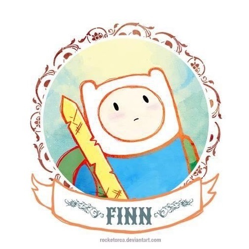

    

 

> An awesome project. /
> 📮: ian_zy@icloud.com / 
> 前进4！ / 
> Viva La Vida
## 二向箔
二向箔（Two-dimensional foil）是刘慈欣的科幻小说《三体》系列中提到的一种虚构的武器。它是一种高维打击武器，能够将一个三维空间的物体或区域压缩成二维平面，从而完全摧毁其中的所有物质。

二向箔象征着极端的力量与决绝，能够在瞬间改变局势或彻底颠覆现状。

学习记录，自我积累，虽然不能瞬间，但总有一天，总有一天，蝴蝶效应、量变推动质变，改变局势颠覆现状。
**_每个人手里都有属于自己的二向箔_**

[//]: # (### My all skill)

[//]: # ()
[//]: # (java ✊)

[//]: # ()
[//]: # (---)

[//]: # (### My favorite)

[//]: # (- For Coding)

[//]: # (- For Browsing)

[//]: # (- For operating system)

[//]: # (- For chat)

[//]: # (- For )

[//]: # (- Not just it...)

[//]: # ()
[//]: # (---)