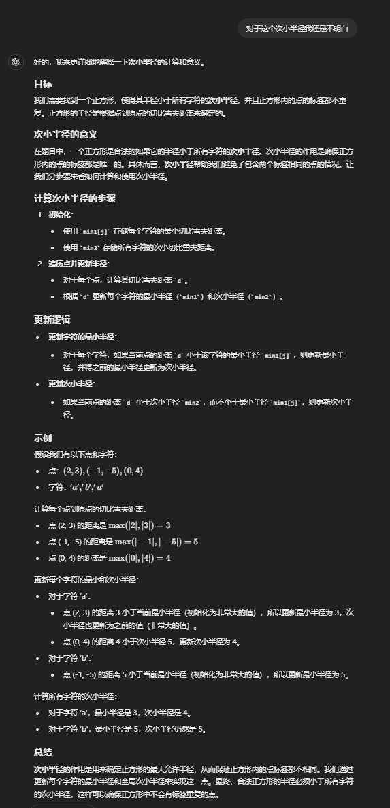

# 8月
## 8月11日
### [44. 开发商购买土地](https://kamacoder.com/problempage.php?pid=1044)
>在一个城市区域内，被划分成了n * m个连续的区块，每个区块都拥有不同的权值，代表着其土地价值。目前，有两家开发公司，A 公司和 B 公司，希望购买这个城市区域的土地。
现在，需要将这个城市区域的所有区块分配给 A 公司和 B 公司。
然而，由于城市规划的限制，只允许将区域按横向或纵向划分成两个子区域，而且每个子区域都必须包含一个或多个区块。
为了确保公平竞争，你需要找到一种分配方式，使得 A 公司和 B 公司各自的子区域内的土地总价值之差最小。

         
      import java.util.Scanner;

      public class Main{
         public static void main (String[] args) {
            Scanner sc = new Scanner(System.in);
            int n = sc.nextInt();
            int m = sc.nextInt();
            
            int sum = 0;
            int[][] vec = new int[n][m];
            for(int i = 0; i < n; i++){
               for(int j = 0; j < m; j++){
                   vec[i][j] = sc.nextInt();
                   sum += vec[i][j];
               }
            }
           
            int[] h = new int[n];
              for(int i = 0; i < n; i++){
                  for(int j = 0; j < m; j++){
                      h[i] += vec[i][j];
                  }
              }
              
              int[] c = new int[m];
              for(int i = 0; i < n; i++){
                  for(int j = 0; j < m; j++){
                      c[j] += vec[i][j];
                  }
              }
              
              int ans = Integer.MAX_VALUE;
              int hSum = 0;
              for(int i =0 ; i < n; i++){
                  hSum += h[i];
                  ans = Math.min(ans,Math.abs(sum - 2*hSum));
              }
              
              int cSum = 0;
              for(int i = 0; i < m; i++){
                  cSum += c[i];
                  ans = Math.min(ans,Math.abs(sum - 2*cSum));
              }
              System.out.println(ans);
              sc.close();
         }
      }
         
         
## 8月10日
### [58. 区间和（前缀和）](https://kamacoder.com/problempage.php?pid=1070)
>给定一个整数数组 Array，请计算该数组在每个指定区间内元素的总和。

用前缀和，很简单的一道题，下标 'a-b' 的区间和为'p[b] - p[a-1]'
      
      import java.util.Scanner;
   
      public class Main{
         public static void main (String[] args) {
            Scanner scanner = new Scanner(System.in);
            int n = scanner.nextInt();
            int[] arr = new int[n];
            for(int i = 0; i < n ; i++){
               arr[i] = scanner.nextInt();
            }
            int[] p = new int[n];
            p[0] = arr[0];
            for(int i = 1;i < n; i++){
               p[i] = p[i-1] + arr[i];
            }
   
           while(scanner.hasNextInt()){
               int a = scanner.nextInt();
               int b = scanner.nextInt();
               
               int ans = a == 0 ? p[b] : p[b] - p[a-1];
               
               System.out.println(ans);
           }
            scanner.closer();
         }
      }
            
            
         
         
## 8月9日（模拟）
### [LCR 146. 螺旋遍历二维数组（模拟）](https://leetcode.cn/problems/shun-shi-zhen-da-yin-ju-zhen-lcof/description/)
>给定一个二维数组 array，请返回「螺旋遍历」该数组的结果。
螺旋遍历：从左上角开始，按照 向右、向下、向左、向上 的顺序 依次 提取元素，然后再进入内部一层重复相同的步骤，直到提取完所有元素。   
>示例 1：   
输入：array = [[1,2,3],[8,9,4],[7,6,5]]   
输出：[1,2,3,4,5,6,7,8,9]  
> 示例 2：  
输入：array  = [[1,2,3,4],[12,13,14,5],[11,16,15,6],[10,9,8,7]]
输出：[1,2,3,4,5,6,7,8,9,10,11,12,13,14,15,16]
      
      class Solution {
          public int[] spiralArray(int[][] array) {
              int m = array.length;
              if(array == null || m == 0){
                  return new int[0];
              }
              int n = array[0].length;
              int[] ans = new int[m*n];
              int j = 0;
              int l = 0,r = n-1,t = 0,b = m-1;
              while(true){
                  for(int i = l; i <= r; i++){
                      ans[j++] = array[t][i];
                  }
                  if(++t > b) break;
                  for(int i = t; i <= b; i++){
                      ans[j++] = array[i][r];
                  }
                  if(--r < l) break;
                  for(int i = r; i >= l; i--){
                      ans[j++] = array[b][i];
                  }
                  if(--b < t) break;
                  for(int i = b; i >= t; i--){
                      ans[j++] = array[i][l];
                  }
                  if(++l > r) break;
              }
              return ans;
          }
      }
      
      
### [54. 螺旋矩阵（模拟）](https://leetcode.cn/problems/spiral-matrix/description/)
>给你一个 m 行 n 列的矩阵 matrix ，请按照 顺时针螺旋顺序 ，返回矩阵中的所有元素。  
> 示例 1：  
> 输入：matrix = [[1,2,3],[4,5,6],[7,8,9]]   
输出：[1,2,3,6,9,8,7,4,5]  
> 示例 2：  
> 输入：matrix = [[1,2,3,4],[5,6,7,8],[9,10,11,12]]   
输出：[1,2,3,4,8,12,11,10,9,5,6,7]

      class Solution {
          public List<Integer> spiralOrder(int[][] matrix) {
              ArrayList<Integer> res = new ArrayList<>();
              int m = matrix.length,n = matrix[0].length;
              int l = 0,r = n-1,t = 0,b = m-1;
              while(true){
                  for(int i = l; i <= r;i++){
                      res.add(matrix[t][i]);
                  }
                  if(++t > b) break;
                  for(int i = t; i <= b;i++){
                      res.add(matrix[i][r]);
                  }
                  if(--r < l) break;
                  for(int i = r; i >= l;i--){
                      res.add(matrix[b][i]);
                  }
                  if(--b < t) break; 
                  for(int i = b; i >= t;i--){
                      res.add(matrix[i][l]);
                  }
                  if(++l > r) break;
              }
              return res;
          }
      }
      
      
      
      
### [59. 螺旋矩阵 II（模拟）](https://leetcode.cn/problems/spiral-matrix-ii/)
>给你一个正整数 n ，生成一个包含 1 到 n2 所有元素，且元素按顺时针顺序螺旋排列的 n x n 正方形矩阵 matrix 。   
> 示例 1：  
> 输入：n = 3  
>输出：[[1,2,3],[8,9,4],[7,6,5]]    
> 示例 2：  
>输入：n = 1   
> 输出：[[1]]

方法一：
      
      class Solution {
          public int[][] generateMatrix(int n) {
              int[][] ans = new int[n][n];
              int startX = 0, startY = 0;
              int count = 1;
              int loop = 1;
              int offset = 1;
              int i,j;
      
              while(loop <= n / 2){
      
                  for(j = startY;j<n-offset;j++){
                      ans[startX][j] = count++;
                  }
      
                  for(i = startX;i<n-offset;i++){
                      ans[i][j] = count++;
                  }
      
                  for(;j > startX;j--){
                      ans[i][j] = count++;
                  }
      
                  for(;i >startY;i--){
                      ans[i][j] = count++;
                  }
                  startX++;
                  startY++;
                  loop++;
                  offset++;
              }
      
              if(n % 2 == 1){
                  ans[startX][startY] = count;
              }
      
              return ans;
          }
      }
      
方法二：

      class Solution {
          public int[][] generateMatrix(int n) {
              int l = 0, r = n-1,t = 0,b = n -1;
              int tar = n * n,num = 1;
              int[][] ans = new int[n][n];
              while(num <= tar){
                  for(int i = l;i <= r;i++){
                      ans[t][i]=num++;
                  }
                  t++;
                  for(int i = t;i <= b;i++){
                      ans[i][r] = num++;
                  }
                  r--;
                  for(int i = r; i >= l; i--){
                      ans[b][i] = num++;
                  }
                  b--;
                  for(int i = b; i >= t; i--){
                      ans[i][l] =num++; 
                  }
                  l++;
              }
      
              return ans;
          }
      }
      
## 8月8日（滑动窗口）
### [904. 水果成篮（滑动窗口）](https://leetcode.cn/problems/fruit-into-baskets/)
>你正在探访一家农场，农场从左到右种植了一排果树。这些树用一个整数数组 fruits 表示，其中 fruits[i] 是第 i 棵树上的水果 种类 。
你想要尽可能多地收集水果。然而，农场的主人设定了一些严格的规矩，你必须按照要求采摘水果：
你只有 两个 篮子，并且每个篮子只能装 单一类型 的水果。每个篮子能够装的水果总量没有限制。
你可以选择任意一棵树开始采摘，你必须从 每棵 树（包括开始采摘的树）上 恰好摘一个水果 。采摘的水果应当符合篮子中的水果类型。每采摘一次，你将会向右移动到下一棵树，并继续采摘。
一旦你走到某棵树前，但水果不符合篮子的水果类型，那么就必须停止采摘。
给你一个整数数组 fruits ，返回你可以收集的水果的 最大 数目。    
> 示例 1：  
输入：fruits = [1,2,1]  
输出：3  
解释：可以采摘全部 3 棵树。
> 示例 2：  
输入：fruits = [0,1,2,2]   
输出：3  
解释：可以采摘 [1,2,2] 这三棵树。
如果从第一棵树开始采摘，则只能采摘 [0,1] 这两棵树。

很明显的滑动窗口的题，连续的，维护一个子窗口，只不过维护窗口的依据是窗口内水果的种类，
自然就想到用 map 来统计，当 map 的长度大于 2 的时候，left 向右移动并维护 map ，需要注意的
一点是 map 统计种类数量为 0 时，要 remove 

      class Solution {
          public int totalFruit(int[] fruits) {
              HashMap<Integer,Integer> kind = new HashMap<>();
              int i = 0;
              int res = 0;
              for(int j = 0; j < fruits.length; j++){
                  kind.put(fruits[j],kind.getOrDefault(fruits[j],0) +1);
                  while(kind.size() > 2 ){
                      kind.put(fruits[i],kind.get(fruits[i])-1);
                      if(kind.get(fruits[i]) == 0){
                          kind.remove(fruits[i]);
                      }
                      i++;
                  }
                  res = Math.max(res,j-i+1);
              }
      
              return res;
          }
      }
      
      
         
### [76. 最小覆盖子串（滑动窗口）](https://leetcode.cn/problems/minimum-window-substring/)
>给你一个字符串 s 、一个字符串 t 。返回 s 中涵盖 t 所有字符的最小子串。如果 s 中不存在涵盖 t 所有字符的子串，则返回空字符串 "" 。  
> 注意：    
>- 对于 t 中重复字符，我们寻找的子字符串中该字符数量必须不少于 t 中该字符数量。
>- 如果 s 中存在这样的子串，我们保证它是唯一的答案。 

>示例 1：
输入：s = "ADOBECODEBANC", t = "ABC"
输出："BANC"
解释：最小覆盖子串 "BANC" 包含来自字符串 t 的 'A'、'B' 和 'C'。  
> 示例 2：
输入：s = "a", t = "a"
输出："a"
解释：整个字符串 s 是最小覆盖子串。

      
         class Solution {
             HashMap<Character,Integer> smap = new HashMap<>();
             HashMap<Character,Integer> tmap = new HashMap<>();
             public String minWindow(String s, String t) {
                 int l = 0,r = -1,len = Integer.MAX_VALUE;
                 int ansL = -1,ansR = -1;
                 for(int i = 0; i < t.length();i++){
                     char c = t.charAt(i);
                     tmap.put(c,tmap.getOrDefault(c,0)+1);
                 }
                 while(r < s.length()){
                     r++;
                     if(r < s.length() && tmap.containsKey(s.charAt(r))){
                         smap.put(s.charAt(r),smap.getOrDefault(s.charAt(r),0)+1);
                     }
                     
         
                     while(check() && l <= r){
                         if((r-l+1) < len){
                             ansL = l;
                             ansR = r;
                             len = r-l+1;
                         }
                         if(tmap.containsKey(s.charAt(l))){
                             smap.put(s.charAt(l),smap.getOrDefault(s.charAt(l),0)-1);
                         }
                         l++;
                     }
                 }
         
         
                 return  ansL == -1 ? "" : s.substring(ansL,ansR+1);
             }
         
             boolean check(){
                 for(Character c : tmap.keySet()){
                     if(smap.getOrDefault(c,0) < tmap.get(c)){
                         return false;
                     }
                 }
                 return true;
             }
         }
         
         
## 8月7日（双指针）
### [977.有序数组的平方(双指针)](https://leetcode.cn/problems/squares-of-a-sorted-array/)
>给你一个按 非递减顺序 排序的整数数组 nums，返回 每个数字的平方 组成的新数组，要求也按 非递减顺序 排序。  
示例 1：    
输入：nums = [-4,-1,0,3,10]            
输出：[0,1,9,16,100]       
解释：平方后，数组变为 [16,1,0,9,100]，排序后，数组变为 [0,1,9,16,100]
示例 2：    
输入：nums = [-7,-3,2,3,11]   
输出：[4,9,9,49,121]

暴力做法很简单，平方后加到新数组再排序 O(nlogn)，但双指针时间复杂度更低只需遍历一遍 O(n)

      class Solution {
          public int[] sortedSquares(int[] nums) {
              int[] res = new int[nums.length];
              int k = res.length-1,l = 0,r = nums.length-1;
              while(l <= r){
                  if(nums[l] * nums[l] < nums[r] * nums[r]){
                      res[k--] = nums[r] * nums[r];
                      r--;
                  }else{
                      res[k--] = nums[l] * nums[l];
                      l++;
                  }
              }
              return res;
          }
      }

### [209.长度最小的子数组(滑动窗口)](https://leetcode.cn/problems/minimum-size-subarray-sum/)
>给定一个含有 n 个正整数的数组和一个正整数 s ，找出该数组中满足其和 ≥ s 的长度最小的 连续 子数组，并返回其长度。如果不存在符合条件的子数组，返回 0。     
示例：   
输入：s = 7, nums = [2,3,1,2,4,3]   
输出：2  
解释：子数组 [4,3] 是该条件下的长度最小的子数组。

      class Solution {
          public int minSubArrayLen(int target, int[] nums) {
              int res = Integer.MAX_VALUE;
              int i = 0;
              int sum = 0;
              for(int j = 0; j < nums.length; j++){
                  sum += nums[j];
                  while(sum >= target){
                      res = Math.min(res,j-i+1);
                      sum -= nums[i++];
                  }
              }
              return res == Integer.MAX_VALUE ? 0 : res;
          }
      }

## 8月6日之无论如何非得把二分搞得明明白白
### [704. 二分查找（二分）](https://leetcode.cn/problems/binary-search/)
>给定一个 n 个元素有序的（升序）整型数组 nums 和一个目标值 target  ，写一个函数搜索 nums 中的 target，如果目标值存在返回下标，否则返回 -1。

首先使用二分查找必须满足两个条件：
- 元素数组有序
- 查找的元素只有一个
涉及边界问题，二分有两种写法，左闭右闭、左闭右开，只要在处理边界时坚持开始对区间的定义，二分就很简单。
#### 左闭右闭
- 定义 'right' 时要为数组长度 -1，因为右闭，所以会对 'nums[right]' 和 'target' 直接比较，避免角标越界
- 'while(left <= right)'，因为是'[left,right]'所以 'left = right' 时是成立的
- 'middle = right - 1'    
   
   
     class Solution {
         public int search(int[] nums, int target) {
            int left = 0,right = nums.length - 1;
            while(left <= right){
               int middle = right + ((left - right) >> 1);
                  if(nums[middle] > target){
                  right = middle - 1;
               }else if(nums[middle] < target){
                  left = middle + 1;
               }else{
                  return middle;
               }
            }
         
           return -1;
         }
     }
      

#### 左闭右开
- 定义 'right' 时要为数组长度，因为右开
- 'while(left < right)'，因为是 '[left,right)'所以 'left = right' 是不成立的
- 'middle = right'，因为右开    
      
      
      class Solution {
          public int search(int[] nums, int target) {
              int left = 0, right = nums.length;
              while(left<right){
                  int middle = right + ((left - right)>>1);
                  if(nums[middle] > target){
                      right = middle;
                  }else if(nums[middle] < target){
                      left = middle + 1;
                  }else{
                      return middle;
                  }
              }
              return -1;
          }
      }
      
      
### [27. 移除元素（双指针）](https://leetcode.cn/problems/remove-element/)
>给你一个数组 nums 和一个值 val，你需要 原地 移除所有数值等于 val 的元素，并返回移除后数组的新长度。
>不要使用额外的数组空间，你必须仅使用 O(1) 额外空间并原地修改输入数组。
>元素的顺序可以改变。你不需要考虑数组中超出新长度后面的元素。  
>示例 1: 给定 nums = [3,2,2,3], val = 3, 函数应该返回新的长度 2, 并且 nums 中的前两个元素均为 2。 你不需要考虑数组中超出新长度后面的元素。    
>示例 2: 给定 nums = [0,1,2,2,3,0,4,2], val = 2, 函数应该返回新的长度 5, 并且 nums 中的前五个元素为 0, 1, 3, 0, 4。

根据题意很明显要用双指针，暴力做法要双循环，快慢指针只需一层循环，快指针找到符合条件元素，满指针直接覆盖原数组

      class Solution {
         public int removeElement(int[] nums, int val) {
            int slow = 0;
            for(int fast = 0; fast < nums.length;fast++ ){
               if(nums[fast] != val){
               nums[slow++] = nums[fast];
               }
            }
            return slow;
         }
      }

## 8月5日
### [600. 不含连续1的非负整数（动态规划）](https://leetcode.cn/problems/non-negative-integers-without-consecutive-ones/?envType=daily-question&envId=2024-08-05)
>给定一个正整数 n ，请你统计在 [0, n] 范围的非负整数中，有多少个整数的二进制表示中不存在 连续的 1 。  
> 示例 1:     
>输入: n = 5 输出: 5   
解释:
下面列出范围在 [0, 5] 的非负整数与其对应的二进制表示：     
0 : 0       
1 : 1       
2 : 10      
3 : 11      
4 : 100     
5 : 101     
其中，只有整数 3 违反规则（有两个连续的 1 ），其他 5 个满足规则。       
> 示例 2:     
输入: n = 1
输出: 2       
> 示例 3:     
输入: n = 2
输出: 3

这个问题可以使用动态规划来解决。    
#### 具体步骤：
1. 理解问题：我们要找到在 [0, n] 范围内的所有非负整数中，其二进制表示中没有连续的 1 的整数数量。例如，数字 5 的二进制表示为 101，不包含连续的 1，所以它是符合条件的。而数字 3 的二进制表示为 11，包含连续的 1，所以它不符合条件。
2. Fibonacci 数列的联系：我们可以发现一个规律，如果一个整数的二进制表示中没有连续的 1，那么它可以由前一个或前两个较小的整数构成。这有点像 Fibonacci 数列的构建方式。具体来说：
    - 长度为 1 的二进制字符串中没有连续 1 的有 2 个：0 和 1。
    - 长度为 2 的二进制字符串中没有连续 1 的有 3 个：00、01 和 10。
    - 长度为 3 的二进制字符串中没有连续 1 的有 5 个：000、001、010、100 和 101。
3. 动态规划状态转移：我们使用两个数组 dp0 和 dp1 分别表示以 0 和 1 结尾的、长度为 i 的二进制字符串中没有连续 1 的个数。
    - dp0[i] 表示长度为 i，以 0 结尾的二进制字符串个数。
    - dp1[i] 表示长度为 i，以 1 结尾的二进制字符串个数。
4. 状态转移方程：
    - dp0[i] = dp0[i-1] + dp1[i-1]，因为可以在长度为 i-1 的所有字符串后面加一个 0。
    - dp1[i] = dp0[i-1]，因为可以在长度为 i-1 的、以 0 结尾的所有字符串后面加一个 1，但不能在以 1 结尾的字符串后面再加一个 1。
5. 结果：我们需要将上述状态转移方程计算到 n，然后将所有结果累加。

    
       class Solution {
           public int findIntegers(int n) {
               // Convert n to binary and get the length
               String binary = Integer.toBinaryString(n);
               int len = binary.length();
       
               // Arrays to store the counts
               int[] dp0 = new int[len + 1];
               int[] dp1 = new int[len + 1];
       
               // Initialize base cases
               dp0[1] = 1; // 0
               dp1[1] = 1; // 1
       
               // Fill the dp arrays
               for (int i = 2; i <= len; i++) {
                   dp0[i] = dp0[i - 1] + dp1[i - 1];
                   dp1[i] = dp0[i - 1];
               }
       
               // Result to store the count of valid numbers
               int result = 0;
       
               // Variable to store previous digit
               int prevBit = 0;
       
               // Traverse the binary representation of n
               for (int i = 0; i < len; i++) {
                   if (binary.charAt(i) == '1') {
                       // Add the count of valid numbers of length (len - i - 1)
                       result += dp0[len - i];
                       if (prevBit == 1) {
                           // If there are consecutive ones, break
                           break;
                       }
                       prevBit = 1;
                   } else {
                       prevBit = 0;
                   }
       
                   // If we are at the last bit
                   if (i == len - 1) {
                       result += 1;
                   }
               }
       
               return result;
           }
       }

#### 解释:
- 转换与长度计算：将 n 转换为二进制字符串，并计算其长度 len。
- 初始化：初始化两个数组 dp0 和 dp1。
- 填充数组：使用状态转移方程填充数组。
- 结果计算：遍历二进制字符串的每一位，如果遇到 1，则累加有效数字的数量，并且根据前一位判断是否有连续的 1。

这个方法的时间复杂度是 O(log(n))，因为处理的最大位数是二进制表示的位数，空间复杂度也是 O(log(n))。这样就能有效地统计范围内符合条件的整数数量。
    

## 8月4日
### [572. 另一棵树的子树](https://leetcode.cn/problems/subtree-of-another-tree/description/?envType=daily-question&envId=2024-08-04)
>给你两棵二叉树 root 和 subRoot 。检验 root 中是否包含和 subRoot 具有相同结构和节点值的子树。如果存在，返回 true ；否则，返回 false 。
>二叉树 tree 的一棵子树包括 tree 的某个节点和这个节点的所有后代节点。tree 也可以看做它自身的一棵子树。        
> 示例 1：     
> 输入：root = [3,4,5,1,2], subRoot = [4,1,2]      
> 输出：true       
> 示例 2：     
> 输入：root = [3,4,5,1,2,null,null,null,null,0], subRoot = [4,1,2]        
> 输出：false

关于二叉树，我自然首先想到递归，思路就是暴力遍历 root 上每个子树与 subRoot 比较是否相等，遍历子树需要一次 dfs ，判断是否相等也通过 dfs 来判断两个树上每个节点值
是否相等。

    class Solution {
        public boolean isSubtree(TreeNode root, TreeNode subRoot) {
            return dfs(root,subRoot);
        }
    
        boolean dfs(TreeNode r,TreeNode s){
            if(r == null){
                return false;
            }
    
            return check(r,s) || dfs(r.left,s) || dfs(r.right,s);
        }
    
        boolean check(TreeNode r,TreeNode s){
            if(r == null && s == null){
                return true;
            }
            if(r == null || s == null || r.val != s.val){
                return false;
            }
    
            return check(r.left,s.left) && check(r.right,s.right);
        }
    }
复杂度分析：
- 时间复杂度：对于每一个 s 上的点，都需要做一次深度优先搜索来和 t 匹配，匹配一次的时间代价是 O(∣t∣)，那么总的时间代价就是 O(∣s∣×∣t∣)。故渐进时间复杂度为 O(∣s∣×∣t∣)。
- 空间复杂度：假设 s 深度为 ds ，t 的深度为 dt，任意时刻栈空间的最大使用代价是O(max{ds ,dt})。故渐进空间复杂度为 O(max{ds,dt})。

## 8月3日
### [3143. 正方形中的最多点数](https://leetcode.cn/problems/maximum-points-inside-the-square/?envType=daily-question&envId=2024-08-03)
>给你一个二维数组 points 和一个字符串 s ，其中 points[i] 表示第 i 个点的坐标，s[i] 表示第 i 个点的 标签 。如果一个正方形的中心在 (0, 0) ，所有边都平行于坐标轴，且正方形内 不 存在标签相同的两个点，那么我们称这个正方形是 合法 的。请你返回 合法 正方形中可以包含的 最多 点数。  
>注意：    
>如果一个点位于正方形的边上或者在边以内，则认为该点位于正方形内。正方形的边长可以为零。
>
>输入：points = [[2,2],[-1,-2],[-4,4],[-3,1],[3,-3]], s = "abdca"  输出：2    
> 解释：边长为 4 的正方形包含两个点 points[0] 和 points[1] 。
>
> 输入：points = [[1,1],[-2,-2],[-2,2]], s = "abb"     
> 输出：1  
> 解释： 边长为 2 的正方形包含 1 个点 points[0] 。

这道题没有思路，看题解的时候对于合法正方形半径必须都小于每个字符的次小半径很难理解，通过后 charGPT 理解了，贴一下

复杂度分析：   
时间复杂度：O(n)，其中 n 是数组的长度。     
空间复杂度：O(∣Σ∣)，其中 Σ 是小写字符集的大小， Σ=26。

    class Solution {
        public int maxPointsInsideSquare(int[][] points, String s) {
            int[] min1 = new int[26];
            int n = s.length();
            int min2 = 1000000001;
            Arrays.fill(min1,1000000001);
            for(int i = 0; i < n; i++){
                int[] point = points[i];
                int j = s.charAt(i) - 'a';
                int d = Math.max(Math.abs(point[0]),Math.abs(point[1]));
                if(d < min1[j]){
                    min2 = Math.min(min2,min1[j]);
                    min1[j] = d;
                }else if(d < min2){
                    min2 = d;
                }
            }
    
            int res = 0;
            for(int i : min1){
                if(i < min2){
                    res++;
                }
            }
    
            return res;
        }
    }

## 8月2日
### [LCP 40. 心算挑战](https://leetcode.cn/problems/uOAnQW/?envType=daily-question&envId=2024-08-01)
>「力扣挑战赛」心算项目的挑战比赛中，要求选手从 N 张卡牌中选出 cnt 张卡牌，若这 cnt 张卡牌数字总和为偶数，则选手成绩「有效」且得分为 cnt 张卡牌数字总和。 给定数组 cards 和 cnt，其中 cards[i] 表示第 i 张卡牌上的数字。 请帮参赛选手计算最大的有效得分。若不存在获取有效得分的卡牌方案，则返回 0。
> 
>示例 1：
>输入：cards = [1,2,8,9], cnt = 3 
>输出：18  
>解释：选择数字为 1、8、9 的这三张卡牌，此时可获得最大的有效得分 1+8+9=18。
>
>示例 2：
>输入：cards = [3,3,1], cnt = 1
>输出：0   
>解释：不存在获取有效得分的卡牌方案。     
> 
>提示：    
>1 <= cnt <= cards.length <= 10^5   
>1 <= cards[i] <= 1000

首先第一个想到的是肯定需要从大到小进行排序，然后取出前 cnt 张卡牌，如果和为偶，直接返回，如果为奇，则有两种选择：

- 在剩下中找到最大的奇数替换已选中最小的偶数；
- 在剩下中找到最大的偶数替换已选中最小的奇数；

在这两种方案中选择和最大的即可

    class Solution {
        public int maxmiumScore(int[] cards, int cnt) {
            Arrays.sort(cards);
            int res = 0;
            int tmp = 0;
            int odd = -1;
            int even = -1;
            for(int i = cards.length -1; i >= cards.length-cnt; i--){
                tmp += cards[i];
                if((cards[i] & 1) == 0){
                    even = cards[i];
                }else{
                    odd = cards[i];
                }
            }
    
            if((tmp & 1 )== 0){
                return tmp;
            }
    
            for(int i = cards.length - cnt - 1; i >= 0; i--){
                if((cards[i] & 1) != 0){
                    if(even != -1){
                        res = Math.max(res,tmp + cards[i] - even);
                        break;
                    }
                }
            }
    
            for(int i = cards.length - cnt - 1; i >= 0; i--){
                if((cards[i] & 1 )== 0){
                    if(odd != -1){
                        res = Math.max(res,tmp + cards[i] - odd);
                        break;
                    }
                }
            }
    
            return res;
        }
    }

由于是升序排列，逆序遍历，所以取出最后一张卡牌时，odd 和 even 是所选卡牌中最小的奇数和偶数。     
提醒一下，num & 1 可以快速判断奇偶，num & 1 == 0 为偶，否则为奇