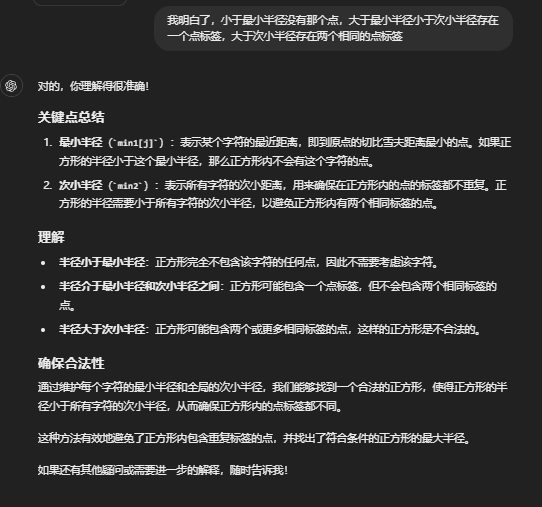

# 8月
## 8月28日（二叉树）
### [236. 二叉树的最近公共祖先](https://leetcode.cn/problems/lowest-common-ancestor-of-a-binary-tree/description/)
>给定一个二叉树, 找到该树中两个指定节点的最近公共祖先。
百度百科中最近公共祖先的定义为：“对于有根树 T 的两个节点 p、q，最近公共祖先表示为一个节点 x，满足 x 是 p、q 的祖先且 x 的深度尽可能大（一个节点也可以是它自己的祖先）。”

````java

````
### [222.完全二叉树的节点个数](https://leetcode.cn/problems/count-complete-tree-nodes/description/)
>给你一棵 完全二叉树 的根节点 root ，求出该树的节点个数。
完全二叉树 的定义如下：在完全二叉树中，除了最底层节点可能没填满外，其余每层节点数都达到最大值，并且最下面一层的节点都集中在该层最左边的若干位置。若最底层为第 h 层，则该层包含 1~ 2h 个节点。

递归
````java
/**
 * Definition for a binary tree node.
 * public class TreeNode {
 *     int val;
 *     TreeNode left;
 *     TreeNode right;
 *     TreeNode() {}
 *     TreeNode(int val) { this.val = val; }
 *     TreeNode(int val, TreeNode left, TreeNode right) {
 *         this.val = val;
 *         this.left = left;
 *         this.right = right;
 *     }
 * }
 */
class Solution {
    public int countNodes(TreeNode root) {
        if(root ==null) return 0;
        return countNodes(root.left) + countNodes(root.right) + 1;
    }
}
````

迭代版
````java
/**
 * Definition for a binary tree node.
 * public class TreeNode {
 *     int val;
 *     TreeNode left;
 *     TreeNode right;
 *     TreeNode() {}
 *     TreeNode(int val) { this.val = val; }
 *     TreeNode(int val, TreeNode left, TreeNode right) {
 *         this.val = val;
 *         this.left = left;
 *         this.right = right;
 *     }
 * }
 */
class Solution {
    public int countNodes(TreeNode root) {
        if(root == null) return 0;
        Deque<TreeNode> stack = new ArrayDeque<>();
        stack.push(root);
        int ans = 0;
        while(!stack.isEmpty()){
            int len = stack.size();
            while(len > 0){
                TreeNode node = stack.pop();
                if(node.left != null) stack.push(node.left);
                if(node.right != null) stack.push(node.right);
                len--;
                ans++;
            }
        }
        return ans;
    }
}
````
## 8月27日（二叉树）
### [559. N 叉树的最大深度](https://leetcode.cn/problems/maximum-depth-of-n-ary-tree/description/)
>给定一个 N 叉树，找到其最大深度。
最大深度是指从根节点到最远叶子节点的最长路径上的节点总数。
N 叉树输入按层序遍历序列化表示，每组子节点由空值分隔（请参见示例）。

感觉只能迭代，递归的话子节点数量太多的话，感觉栈会溢出
````java
/*
// Definition for a Node.
class Node {
    public int val;
    public List<Node> children;

    public Node() {}

    public Node(int _val) {
        val = _val;
    }

    public Node(int _val, List<Node> _children) {
        val = _val;
        children = _children;
    }
};
*/

class Solution {
    public int maxDepth(Node root) {
        if(root == null) return 0;
        Queue<Node> queue = new ArrayDeque<>();
        int ans = 0;
        queue.offer(root);
        while(!queue.isEmpty()){
            int len = queue.size();
            while(len > 0){
                Node node = queue.poll();
                for(Node n:node.children){
                    if(n != null){
                        queue.offer(n);
                    }
                }
                len--;
            }
            ans++;
        }

        return ans;
    }
}
````

递归版：好吧，不会，因为题目对树有限制
````java
class Solution {
    public int maxDepth(Node root) {
        if (root == null) {
            return 0;
        }
        int maxChildDepth = 0;
        List<Node> children = root.children;
        for (Node child : children) {
            int childDepth = maxDepth(child);
            maxChildDepth = Math.max(maxChildDepth, childDepth);
        }
        return maxChildDepth + 1;
    }
}

````
### [104. 二叉树的最大深度](https://leetcode.cn/problems/maximum-depth-of-binary-tree/description/)
>给定一个二叉树 root ，返回其最大深度。
二叉树的 最大深度 是指从根节点到最远叶子节点的最长路径上的节点数。

递归版：思路很简单，递归左右子树，返回更深的，自身节点也是一层，所以+1
````java
/**
 * Definition for a binary tree node.
 * public class TreeNode {
 *     int val;
 *     TreeNode left;
 *     TreeNode right;
 *     TreeNode() {}
 *     TreeNode(int val) { this.val = val; }
 *     TreeNode(int val, TreeNode left, TreeNode right) {
 *         this.val = val;
 *         this.left = left;
 *         this.right = right;
 *     }
 * }
 */
class Solution {
    public int maxDepth(TreeNode root) {
        if(root == null) return 0;
        return Math.max(maxDepth(root.left),maxDepth(root.right)) + 1;
    }
}
````

迭代版：深度，那就层序遍历呗，一层就+1
````java
/**
 * Definition for a binary tree node.
 * public class TreeNode {
 *     int val;
 *     TreeNode left;
 *     TreeNode right;
 *     TreeNode() {}
 *     TreeNode(int val) { this.val = val; }
 *     TreeNode(int val, TreeNode left, TreeNode right) {
 *         this.val = val;
 *         this.left = left;
 *         this.right = right;
 *     }
 * }
 */
class Solution {
    public int maxDepth(TreeNode root) {
        if(root == null) return 0;
        Queue<TreeNode> queue = new ArrayDeque<>();
        int ans = 0;
        queue.offer(root);
        while(!queue.isEmpty()){
            int len = queue.size();
            while(len > 0){
                TreeNode node = queue.poll();
                if(node.left != null) queue.offer(node.left);
                if(node.right != null) queue.offer(node.right);
                len--;
            }
            ans++;
        }

        return ans;
    }
}
````
### [100. 相同的树](https://leetcode.cn/problems/same-tree/description/)
>给你两棵二叉树的根节点 p 和 q ，编写一个函数来检验这两棵树是否相同。
如果两个树在结构上相同，并且节点具有相同的值，则认为它们是相同的。

本质和对称二叉树的题一样的，只不过两棵树遍历的时候同步进入左右子树，而对称二叉树由于是镜像的，一棵进左另一棵要进右

````java
/**
 * Definition for a binary tree node.
 * public class TreeNode {
 *     int val;
 *     TreeNode left;
 *     TreeNode right;
 *     TreeNode() {}
 *     TreeNode(int val) { this.val = val; }
 *     TreeNode(int val, TreeNode left, TreeNode right) {
 *         this.val = val;
 *         this.left = left;
 *         this.right = right;
 *     }
 * }
 */
class Solution {
    public boolean isSameTree(TreeNode p, TreeNode q) {
        if(p == null && q == null){
            return true;
        }
        if(p == null || q == null){
            return false;
        }

        return p.val == q.val && isSameTree(p.left,q.left) && isSameTree(p.right,q.right);
    }
}
````
### [101. 对称二叉树](https://leetcode.cn/problems/symmetric-tree/description/)
>给你一个二叉树的根节点 root ， 检查它是否轴对称。

````java
/**
 * Definition for a binary tree node.
 * public class TreeNode {
 *     int val;
 *     TreeNode left;
 *     TreeNode right;
 *     TreeNode() {}
 *     TreeNode(int val) { this.val = val; }
 *     TreeNode(int val, TreeNode left, TreeNode right) {
 *         this.val = val;
 *         this.left = left;
 *         this.right = right;
 *     }
 * }
 */
class Solution {
    public boolean isSymmetric(TreeNode root) {
        return check(root,root);
    }

    boolean check(TreeNode p,TreeNode q){
        if(p == null && q == null){
            return true;
        }
        if(p == null || q == null){
            return false;
        }

        return q.val == p.val && check(p.left,q.right) && check(p.right,q.left);
    }
}
````
## 8月26日（二叉树）
### [226. 翻转二叉树](https://leetcode.cn/problems/invert-binary-tree/description/)
>给你一棵二叉树的根节点 root ，翻转这棵二叉树，并返回其根节点。

这道明显递归思路很简单     
递归版：
````java
/**
 * Definition for a binary tree node.
 * public class TreeNode {
 *     int val;
 *     TreeNode left;
 *     TreeNode right;
 *     TreeNode() {}
 *     TreeNode(int val) { this.val = val; }
 *     TreeNode(int val, TreeNode left, TreeNode right) {
 *         this.val = val;
 *         this.left = left;
 *         this.right = right;
 *     }
 * }
 */
class Solution {
    public TreeNode invertTree(TreeNode root) {
        if(root == null) return root;
        root.left = invertTree(root.left);
        root.right = invertTree(root.right);
        TreeNode temp = root.left;
        root.left = root.right;
        root.right = temp;
        return root;
    }
}
````

迭代版：
````java
/**
 * Definition for a binary tree node.
 * public class TreeNode {
 *     int val;
 *     TreeNode left;
 *     TreeNode right;
 *     TreeNode() {}
 *     TreeNode(int val) { this.val = val; }
 *     TreeNode(int val, TreeNode left, TreeNode right) {
 *         this.val = val;
 *         this.left = left;
 *         this.right = right;
 *     }
 * }
 */
class Solution {
    public TreeNode invertTree(TreeNode root) {
        Deque<TreeNode> stack = new ArrayDeque<>();
        if(root == null) return root;
        stack.push(root);
        while(!stack.isEmpty()){
            TreeNode node = stack.pop();
            if(node.left != null) stack.push(node.left);
            if(node.right != null) stack.push(node.right);
            TreeNode temp = node.left;
            node.left = node.right;
            node.right = temp;
        }
        return root;
    }
}
````
## 8月25日（二叉树的层序遍历）
### [102. 二叉树的层序遍历](https://leetcode.cn/problems/binary-tree-level-order-traversal/description/)
>给你二叉树的根节点 root ，返回其节点值的 层序遍历 。 （即逐层地，从左到右访问所有节点）。

````java
/**
 * Definition for a binary tree node.
 * public class TreeNode {
 *     int val;
 *     TreeNode left;
 *     TreeNode right;
 *     TreeNode() {}
 *     TreeNode(int val) { this.val = val; }
 *     TreeNode(int val, TreeNode left, TreeNode right) {
 *         this.val = val;
 *         this.left = left;
 *         this.right = right;
 *     }
 * }
 */
class Solution {
    public List<List<Integer>> levelOrder(TreeNode root) {
        List<List<Integer>> ans = new ArrayList<>();
        if(root == null) return ans;
        Queue<TreeNode> queue = new ArrayDeque<>();
        queue.offer(root);

        while(!queue.isEmpty()){
            List<Integer> list = new ArrayList<>();
            int len = queue.size();
            while(len > 0){
                TreeNode node = queue.poll();
                list.add(node.val);
                if(node.left != null) queue.offer(node.left);
                if(node.right != null) queue.offer(node.right);
                len--;
            }
            ans.add(list);
        }

        return ans;
    }
}
````
### [107. 二叉树的层序遍历 II](https://leetcode.cn/problems/binary-tree-level-order-traversal-ii/description/)
>给你二叉树的根节点 root ，返回其节点值 自底向上的层序遍历 。 （即按从叶子节点所在层到根节点所在的层，逐层从左向右遍历）

````java
/**
 * Definition for a binary tree node.
 * public class TreeNode {
 *     int val;
 *     TreeNode left;
 *     TreeNode right;
 *     TreeNode() {}
 *     TreeNode(int val) { this.val = val; }
 *     TreeNode(int val, TreeNode left, TreeNode right) {
 *         this.val = val;
 *         this.left = left;
 *         this.right = right;
 *     }
 * }
 */
class Solution {
    public List<List<Integer>> levelOrderBottom(TreeNode root) {
        LinkedList<List<Integer>> ans = new LinkedList<>();
        if(root == null) return ans;    
        Queue<TreeNode> queue = new ArrayDeque<>();
        queue.offer(root);
        while(!queue.isEmpty()){
            List<Integer> list = new ArrayList<>();
            int len = queue.size();
            while(len > 0){
                TreeNode node = queue.poll();
                list.add(node.val);
                if(node.left != null) queue.offer(node.left);
                if(node.right != null) queue.offer(node.right);
                len--;
            }
            ans.addFirst(list);
        }

        return ans;
    }
}
````
### [199. 二叉树的右视图](https://leetcode.cn/problems/binary-tree-right-side-view/description/)
>给定一个二叉树的 根节点 root，想象自己站在它的右侧，按照从顶部到底部的顺序，返回从右侧所能看到的节点值。

````java
/**
 * Definition for a binary tree node.
 * public class TreeNode {
 *     int val;
 *     TreeNode left;
 *     TreeNode right;
 *     TreeNode() {}
 *     TreeNode(int val) { this.val = val; }
 *     TreeNode(int val, TreeNode left, TreeNode right) {
 *         this.val = val;
 *         this.left = left;
 *         this.right = right;
 *     }
 * }
 */
class Solution {
    public List<Integer> rightSideView(TreeNode root) {
        List<Integer> ans = new ArrayList<>();
        if(root == null) return ans;
        Queue<TreeNode> queue = new ArrayDeque<>();
        queue.offer(root);
        while(!queue.isEmpty()){
            int len = queue.size();
            int i = queue.peek().val;
            while(len > 0){
                TreeNode node = queue.poll();
                i = node.val;
                if(node.left != null) queue.offer(node.left);
                if(node.right != null) queue.offer(node.right);
                len--;
            }
            ans.add(i);
        }
        return ans;
    }
}
````
### [637. 二叉树的层平均值](https://leetcode.cn/problems/average-of-levels-in-binary-tree/description/)
>给定一个非空二叉树的根节点 root , 以数组的形式返回每一层节点的平均值。与实际答案相差 10-5 以内的答案可以被接受。

````java
/**
 * Definition for a binary tree node.
 * public class TreeNode {
 *     int val;
 *     TreeNode left;
 *     TreeNode right;
 *     TreeNode() {}
 *     TreeNode(int val) { this.val = val; }
 *     TreeNode(int val, TreeNode left, TreeNode right) {
 *         this.val = val;
 *         this.left = left;
 *         this.right = right;
 *     }
 * }
 */
class Solution {
    public List<Double> averageOfLevels(TreeNode root) {
        List<Double> ans = new ArrayList<>();
        Queue<TreeNode> queue = new ArrayDeque<>();
        queue.offer(root);
        while(!queue.isEmpty()){
            int len = queue.size(),size = queue.size();
            Double sum  = 0d;
            while(len > 0){
                TreeNode node = queue.poll();
                sum += node.val;
                if(node.left != null) queue.offer(node.left);
                if(node.right != null) queue.offer(node.right);
                len--;
            }
            ans.add(sum / size);
        }

        return ans;
    }
}
````
### [429. N 叉树的层序遍历](https://leetcode.cn/problems/n-ary-tree-level-order-traversal/description/)
>给定一个 N 叉树，返回其节点值的层序遍历。（即从左到右，逐层遍历）。        
树的序列化输入是用层序遍历，每组子节点都由 null 值分隔（参见示例）。

本质还是一样的，只不过左右节点变成一个 list 维护的子节点，那就遍历加入子节点
````java
/*
// Definition for a Node.
class Node {
    public int val;
    public List<Node> children;

    public Node() {}

    public Node(int _val) {
        val = _val;
    }

    public Node(int _val, List<Node> _children) {
        val = _val;
        children = _children;
    }
};
*/

class Solution {
    public List<List<Integer>> levelOrder(Node root) {
        List<List<Integer>> ans = new ArrayList<>();
        if(root == null) return ans;
        Queue<Node> queue = new ArrayDeque<>();
        queue.offer(root);
        while(!queue.isEmpty()){
            int len = queue.size();
            List<Integer> list = new ArrayList<>();
            while(len > 0){
                Node node = queue.poll();
                list.add(node.val);
                for(Node cur : node.children){
                    queue.offer(cur);
                }
                len--;
            }
            ans.add(list);
        }
        return ans;
    }
}
````
### [515. 在每个树行中找最大值](https://leetcode.cn/problems/find-largest-value-in-each-tree-row/description/)
>给定一棵二叉树的根节点 root ，请找出该二叉树中每一层的最大值。

````java
/**
 * Definition for a binary tree node.
 * public class TreeNode {
 *     int val;
 *     TreeNode left;
 *     TreeNode right;
 *     TreeNode() {}
 *     TreeNode(int val) { this.val = val; }
 *     TreeNode(int val, TreeNode left, TreeNode right) {
 *         this.val = val;
 *         this.left = left;
 *         this.right = right;
 *     }
 * }
 */
class Solution {
    public List<Integer> largestValues(TreeNode root) {
        List<Integer> ans = new ArrayList<>();
        if(root ==null) return ans;
        Queue<TreeNode> queue = new ArrayDeque<>();
        queue.offer(root);
        while(!queue.isEmpty()){
            int len = queue.size();
            int maxVal = Integer.MIN_VALUE;
            while(len > 0){
                TreeNode node = queue.poll();
                maxVal = Math.max(maxVal,node.val);
                if(node.left != null) queue.offer(node.left);
                if(node.right != null) queue.offer(node.right);
                len--;
            }
            ans.add(maxVal);
        }

        return ans;
    }
}
````

### [116. 填充每个节点的下一个右侧节点指针](https://leetcode.cn/problems/populating-next-right-pointers-in-each-node/description/)
>给定一个 完美二叉树 ，其所有叶子节点都在同一层，每个父节点都有两个子节点。二叉树定义如下：
>>struct Node {     
int val;        
Node *left;     
Node *right;        
Node *next;     
}
> 
>填充它的每个 next 指针，让这个指针指向其下一个右侧节点。如果找不到下一个右侧节点，则将 next 指针设置为 NULL。
初始状态下，所有 next 指针都被设置为 NULL。

````java
/*
// Definition for a Node.
class Node {
    public int val;
    public Node left;
    public Node right;
    public Node next;

    public Node() {}
    
    public Node(int _val) {
        val = _val;
    }

    public Node(int _val, Node _left, Node _right, Node _next) {
        val = _val;
        left = _left;
        right = _right;
        next = _next;
    }
};
*/

class Solution {
    public Node connect(Node root) {
        Node ans = root;
        Queue<Node> queue = new ArrayDeque<>();
        if(root == null) return root;
        queue.offer(root);
        while(!queue.isEmpty()){
            int len = queue.size();
            Node pre = null;
            while(len > 0){
                Node cur = queue.poll();
                if(cur.left != null) queue.offer(cur.left);
                if(cur.right != null) queue.offer(cur.right);
                if(pre != null) pre.next = cur;
                pre = cur;
                len--;
            }
        }
        return ans;
    }
}
````

### [117. 填充每个节点的下一个右侧节点指针 II](https://leetcode.cn/problems/populating-next-right-pointers-in-each-node-ii/description/)
>给定一个二叉树：       
>> struct Node {     
int val;            
Node *left;     
Node *right;        
Node *next;     
}   
> 
>填充它的每个 next 指针，让这个指针指向其下一个右侧节点。如果找不到下一个右侧节点，则将 next 指针设置为 NULL 。
初始状态下，所有 next 指针都被设置为 NULL 。

````java
/*
// Definition for a Node.
class Node {
    public int val;
    public Node left;
    public Node right;
    public Node next;

    public Node() {}
    
    public Node(int _val) {
        val = _val;
    }

    public Node(int _val, Node _left, Node _right, Node _next) {
        val = _val;
        left = _left;
        right = _right;
        next = _next;
    }
};
*/

class Solution {
    public Node connect(Node root) {
        Node ans = root;
        Queue<Node> queue = new ArrayDeque<>();
        if(root == null) return root;
        queue.offer(root);
        while(!queue.isEmpty()){
            int len = queue.size();
            Node pre = null;
            while(len > 0){
                Node cur = queue.poll();
                if(cur.left != null) queue.offer(cur.left);
                if(cur.right != null) queue.offer(cur.right);
                if(pre != null) pre.next = cur;
                pre = cur;
                len--;
            }
        }
        return ans;
    }
}
````

### [104. 二叉树的最大深度](https://leetcode.cn/problems/maximum-depth-of-binary-tree/description/)
>给定一个二叉树 root ，返回其最大深度。
二叉树的 最大深度 是指从根节点到最远叶子节点的最长路径上的节点数。

````java
/**
 * Definition for a binary tree node.
 * public class TreeNode {
 *     int val;
 *     TreeNode left;
 *     TreeNode right;
 *     TreeNode() {}
 *     TreeNode(int val) { this.val = val; }
 *     TreeNode(int val, TreeNode left, TreeNode right) {
 *         this.val = val;
 *         this.left = left;
 *         this.right = right;
 *     }
 * }
 */
class Solution {
    public int maxDepth(TreeNode root) {
        int ans = 0;
        if(root == null) return ans;
        Queue<TreeNode> queue = new ArrayDeque<>();
        queue.offer(root);
        while(!queue.isEmpty()){
            int len = queue.size();
            while(len > 0){
                TreeNode node = queue.poll();
                if(node.left != null) queue.offer(node.left);
                if(node.right != null) queue.offer(node.right);
                len--;
            }
            ans++;
        }
        return ans;
    }
}
````

### [111. 二叉树的最小深度](https://leetcode.cn/problems/minimum-depth-of-binary-tree/description/)
>给定一个二叉树，找出其最小深度。
最小深度是从根节点到最近叶子节点的最短路径上的节点数量。
说明：叶子节点是指没有子节点的节点。

````java
/**
 * Definition for a binary tree node.
 * public class TreeNode {
 *     int val;
 *     TreeNode left;
 *     TreeNode right;
 *     TreeNode() {}
 *     TreeNode(int val) { this.val = val; }
 *     TreeNode(int val, TreeNode left, TreeNode right) {
 *         this.val = val;
 *         this.left = left;
 *         this.right = right;
 *     }
 * }
 */
class Solution {
    public int minDepth(TreeNode root) {
        int ans = 0;
        if(root == null) return ans;
        Queue<TreeNode> queue = new ArrayDeque<>();
        queue.offer(root);
        while(!queue.isEmpty()){
            int len = queue.size();
            ans++;
            while(len > 0){
                TreeNode node = queue.poll();
                if(node.left == null && node.right == null){
                    return ans;
                }
                if(node.left != null) queue.offer(node.left);
                if(node.right != null) queue.offer(node.right);
                len--;
            }
        }

        return ans;
    }
}
````

## 8月24日（二叉树的遍历）
### [144. 二叉树的前序遍历](https://leetcode.cn/problems/binary-tree-preorder-traversal/description/)
递归版
```` java
public class TreeNode{
    int val;
    TreeNode left;
    TreeNode right;
    TreeNode(){}
    TreeNode(int val){
        this.val = val;
    }
    TreeNode(int val,TreeNode left,TreeNode right){
        this.val = val;
        this.left = left;
        this.right = right;
    }
}
class Solution{
    public List<Integer> preorderTraversal(TreeNode root){
        List<Integer> list = new ArrayList<>();
        preorder(root,list);
        return list;
    }
    
    void preorder(TreeNode root,List<Integer> list){
        if(root == null) return;
        list.add(root.val);
        preorder(root.left,list);
        preorder(root.right,list);
    }
}
````
迭代版
```` java
/**
 * Definition for a binary tree node.
 * public class TreeNode {
 *     int val;
 *     TreeNode left;
 *     TreeNode right;
 *     TreeNode() {}
 *     TreeNode(int val) { this.val = val; }
 *     TreeNode(int val, TreeNode left, TreeNode right) {
 *         this.val = val;
 *         this.left = left;
 *         this.right = right;
 *     }
 * }
 */
class Solution {
    public List<Integer> preorderTraversal(TreeNode root){
        
        List<Integer> list = new ArrayList<>();
        if(root == null) return list;
        Deque<TreeNode> stack = new ArrayDeque<>();
        stack.push(root);
        while(!stack.isEmpty()){
            TreeNode node = stack.pop();
            list.add(node.val);
            if(node.right != null){
                stack.push(node.right);
            }
            if(node.left != null){
                stack.push(node.left);
            }
        }

        return list;
    }
}
````

### [94. 二叉树的中序遍历](https://leetcode.cn/problems/binary-tree-inorder-traversal/description/)
递归版
```` java
public class TreeNode{
    int val;
    TreeNode left;
    TreeNode right;
    TreeNode(){}
    TreeNode(int val){
        this.val = val;
    }
}

class Solution{
    public List<Integer> inorderTraversal(TreeNode root){
        List<Integer> list = new ArrayList<>();
        inorder(root,list);
        return list;
    }
    
    void inorder(TreeNode root,List<Integer> list){
        if(root == null) return;
        inorder(root.left,list);
        list.add(root.val);
        inorder(root.right,list);
    }
}
````
迭代版
````java
public class TreeNode{
    int val;
    TreeNode left;
    TreeNode right;
    TreeNode(){}
    TreeNode(int val){
        this.val = val;
    }
}

class Solution{
    public List<Integer> inorderTraversal(TreeNode root){
        List<Integer> list = new ArrayList<>();
        Deque<TreeNode> stack = new ArrayDeque<>();
        while(root != null || !stack.isEmpty()){
            while(root != null){
                stack.push(root);
                root = root.left;
            }
            root = stack.pop();
            list.add(root.val);
            root = root.right;
        }

        return list;
    }
}
````

### [145. 二叉树的后序遍历](https://leetcode.cn/problems/binary-tree-postorder-traversal/description/)
递归版
````java
public class TreeNode{
    int val;
    TreeNode left;
    TreeNode right;
    TreeNode(){}
    TreeNode(int val){
        this.val = val;
    }
}

class Solution{
    public List<Integer> postorderTraversal(TreeNode root){
        List<Integer> list = new ArrayList<>();
        postorder(root,list);
        return list;
    }
    
    void postorder(TreeNode root,List<Integer> list){
        if(root == null) return;
        postorder(root.left,list);
        postorder(root.right,list);
        list.add(root.val);
    }
}
````
迭代版
````java
public class TreeNode{
    int val;
    TreeNode left;
    TreeNode right;
    TreeNode(){}
    TreeNode(int val){
        this.val = val;
    }
}

class Solution {
    public List<Integer> postorderTraversal(TreeNode root){
        List<Integer> list = new ArrayList<>();
        Deque<TreeNode> stack = new ArrayDeque<>();
        TreeNode pre = null;
        while(root != null || !stack.isEmpty()){
            while(root != null){
                stack.push(root);
                root = root.left;
            }
            root = stack.pop();
            if(root.right == null || pre == root.right){
                list.add(root.val);
                pre = root;
                root = null;
            }else{
                stack.push(root);
                root = root.right;
            }

        }
        return list;
    }
}
````
## 8月23日（栈和队列）
### [347. 前 K 个高频元素](https://leetcode.cn/problems/top-k-frequent-elements/description/)
>给你一个整数数组 nums 和一个整数 k ，请你返回其中出现频率前 k 高的元素。你可以按 任意顺序 返回答案。      
> 示例 1:     
输入: nums = [1,1,1,2,2,3], k = 2     
输出: [1,2]       
> 示例 2:     
输入: nums = [1], k = 1       
输出: [1]     

先用 map 记录频率，再用优先队列排序，维护小顶堆的长度，大于 k 时，弹出顶部频率低的元素
```` java
class Solution {
    public int[] topKFrequent(int[] nums, int k) {
        Map<Integer,Integer> map = new HashMap<>();
        for(int i:nums){
            map.put(i,map.getOrDefault(i,0) + 1);
        }

        int[] ans = new int[k];
        PriorityQueue<int[]> queue = new PriorityQueue<>((o1,o2) ->o1[1] - o2[1]);
        for(var x : map.entrySet()){
            int[] tmp = new int[2];
            tmp[0] =x.getKey();
            tmp[1] = x.getValue();
            queue.offer(tmp);
            while(queue.size() > k){
                queue.poll();
            }
        }

        for(int i =0; i < k; i++){
            ans[i] = queue.poll()[0];
        }

        return ans;

    }
}
````
### [239. 滑动窗口最大值](https://leetcode.cn/problems/sliding-window-maximum/description/)
>给你一个整数数组 nums，有一个大小为 k 的滑动窗口从数组的最左侧移动到数组的最右侧。你只可以看到在滑动窗口内的 k 个数字。滑动窗口每次只向右移动一位。
返回 滑动窗口中的最大值 。      
> 示例 1：     
输入：nums = [1,3,-1,-3,5,3,6,7], k = 3        
输出：[3,3,5,5,6,7]        

我首先的思路是肯定用优先队列来维护窗口，不用遍历，堆顶的就是最大的，思路和写法是没问题，但还是超时了，题目提示了 1 <= nums.length <= 105 ，那应该是 'queue.remove(num[j++])' 太耗时了，
看了题解之后，确实队列再保存数组下标就解决了，对于队列移除的元素通过下标维护而不是用 remove 方法大大降低时间复杂度，而且最主要的逻辑是对于要移除的数只要不超过当前窗口的最大数就没必要移除，
所以只要判断堆顶的元素下标是否符合在当前窗口的位置，否则移除，直到符合为止。
       
``` java
class Solution {
    public int[] maxSlidingWindow(int[] nums, int k) {
        int n = nums.length;
        Queue<Integer> queue = new PriorityQueue<>(new Comparator<Integer>(){
            public int compare(Integer a, Integer b){
                return b-a;
            }
        });
        int i = 0;
        int[] ans = new int[n-k+1];
        while(i < k){
            queue.offer(nums[i++]);
        }
        int j = 0;
        for(;i < n;i++){
            ans[i-k]=queue.peek();
            queue.remove(nums[j++]);
            queue.offer(nums[i]);
        }
        ans[i-k] = queue.peek();

        return ans;
    }
}
```

    class Solution {
        public int[] maxSlidingWindow(int[] nums, int k) {
            int n = nums.length;
            Queue<int[]> queue = new PriorityQueue<>(new Comparator<int[]>(){
                public int compare(int[] a, int[] b){
                    return a[0] != b[0] ? b[0] - a[0] : b[1] - a[1];
                }
            });
            for(int i = 0; i < k; i++){
                queue.offer(new int[]{nums[i],i});
            }
    
            int[] ans = new int[n-k+1];
            ans[0] = queue.peek()[0];
            for(int i = k;i < n;i++){
                queue.offer(new int[]{nums[i],i});
                while(queue.peek()[1] <= i-k){
                    queue.poll();
                }
                ans[i-k+1] = queue.peek()[0];
            }
    
            return ans;
        }
    }
            
   
另一种解法就是单调队列

            
    class MyQueue {
        Deque<Integer> deque = new LinkedList<>();
        //弹出元素时，比较当前要弹出的数值是否等于队列出口的数值，如果相等则弹出
        //同时判断队列当前是否为空
        void poll(int val) {
            if (!deque.isEmpty() && val == deque.peek()) {
                deque.poll();
            }
        }
        //添加元素时，如果要添加的元素大于入口处的元素，就将入口元素弹出
        //保证队列元素单调递减
        //比如此时队列元素3,1，2将要入队，比1大，所以1弹出，此时队列：3,2
        void add(int val) {
            while (!deque.isEmpty() && val > deque.getLast()) {
                deque.removeLast();
            }
            deque.add(val);
        }
        //队列队顶元素始终为最大值
        int peek() {
            return deque.peek();
        }
    }

    class Solution {
        public int[] maxSlidingWindow(int[] nums, int k) {
            if (nums.length == 1) {
                return nums;
            }
            int len = nums.length - k + 1;
            //存放结果元素的数组
            int[] res = new int[len];
            int num = 0;
            //自定义队列
            MyQueue myQueue = new MyQueue();
            //先将前k的元素放入队列
            for (int i = 0; i < k; i++) {
                myQueue.add(nums[i]);
            }
            res[num++] = myQueue.peek();
            for (int i = k; i < nums.length; i++) {
                //滑动窗口移除最前面的元素，移除是判断该元素是否放入队列
                myQueue.poll(nums[i - k]);
                //滑动窗口加入最后面的元素
                myQueue.add(nums[i]);
                //记录对应的最大值
                res[num++] = myQueue.peek();
            }
            return res;
        }
    }
            
### [150. 逆波兰表达式求值](https://leetcode.cn/problems/evaluate-reverse-polish-notation/description/)
>给你一个字符串数组 tokens ，表示一个根据 逆波兰表示法 表示的算术表达式。
请你计算该表达式。返回一个表示表达式值的整数。
注意：
有效的算符为 '+'、'-'、'*' 和 '/' 。
每个操作数（运算对象）都可以是一个整数或者另一个表达式。
两个整数之间的除法总是 向零截断 。
表达式中不含除零运算。
输入是一个根据逆波兰表示法表示的算术表达式。
答案及所有中间计算结果可以用 32 位 整数表示。       
> 示例 1：     
输入：tokens = ["2","1","+","3","*"]       
输出：9        
解释：该算式转化为常见的中缀算术表达式为：((2 + 1) * 3) = 9     

栈模拟

    class Solution {
        public int evalRPN(String[] tokens) {
            if(tokens.length == 1) return Integer.parseInt(tokens[0]);
            Deque<Integer> stack = new ArrayDeque<>();
            int a;
            int b;
            for(int i = 0; i < tokens.length; i++){
                String s = tokens[i];
                if(s.equals("+")){
                    a = stack.pop();
                    b = stack.pop();
                    stack.push(a + b);
                }else if(s.equals("-")){
                    a = stack.pop();
                    b = stack.pop();
                    stack.push(b-a);
                }else if(s.equals("*")){
                    a = stack.pop();
                    b = stack.pop();
                    stack.push(b*a);
                }else if(s.equals("/")){
                    a = stack.pop();
                    b = stack.pop();
                    stack.push(b/a);
                }else{
                    stack.push(Integer.parseInt(s));
                }
            }
            return stack.pop();
            
        }
    }
        
        
## 8月22日（栈和队列）
### [1047. 删除字符串中的所有相邻重复项](https://leetcode.cn/problems/remove-all-adjacent-duplicates-in-string/description/)
>给出由小写字母组成的字符串 S，重复项删除操作会选择两个相邻且相同的字母，并删除它们。
在 S 上反复执行重复项删除操作，直到无法继续删除。
在完成所有重复项删除操作后返回最终的字符串。答案保证唯一。       
> 示例：       
输入："abbaca"     
输出："ca"     

    class Solution {
        public String removeDuplicates(String s) {
            char[] ch = s.toCharArray();
            Deque<Character> stack = new LinkedList<>();
            for(int i = 0;i < ch.length; i++){
                char c = ch[i];
                if(!stack.isEmpty() && stack.peek() == c){
                    stack.pop();
                    continue;
                }else{
                    stack.push(c);
                }
            }
            StringBuilder ans = new StringBuilder();
            while(!stack.isEmpty()){
                ans.append(stack.pop());
            }
    
            return ans.reverse().toString();
        }
    }
            
### [20. 有效的括号](https://leetcode.cn/problems/valid-parentheses/description/)
>给定一个只包括 '('，')'，'{'，'}'，'['，']' 的字符串 s ，判断字符串是否有效。
有效字符串需满足：
左括号必须用相同类型的右括号闭合。
左括号必须以正确的顺序闭合。
每个右括号都有一个对应的相同类型的左括号。       
> 示例 1：     
输入：s = "()"         
输出：true                 
> 示例 2：     
输入：s = "()[]{}"     
输出：true
        
    class Solution {
        public boolean isValid(String s) {
            Deque<Character> stack = new LinkedList<>();
            char[] ch = s.toCharArray();
            for(int i = 0; i < ch.length; i++){
                if(ch[i] == '('){
                    stack.push(')');
                }else if(ch[i] == '['){
                    stack.push(']');
                }else if(ch[i] == '{'){
                    stack.push('}');
                }else if(stack.isEmpty() || ch[i] != stack.pop()){
                    return false;
                }
            }
            return stack.isEmpty();
        }
    }
            

### [232. 用栈实现队列](https://leetcode.cn/problems/implement-queue-using-stacks/description/)
>请你仅使用两个栈实现先入先出队列。队列应当支持一般队列支持的所有操作（push、pop、peek、empty）：       
>实现 MyQueue 类：       
>- void push(int x) 将元素 x 推到队列的末尾
>- int pop() 从队列的开头移除并返回元素
>- int peek() 返回队列开头的元素
>- boolean empty() 如果队列为空，返回 true ；否则，返回 false      
>
>示例 1：      
输入：             
["MyQueue", "push", "push", "peek", "pop", "empty"]         
[[], [1], [2], [], [], []]          
输出：     
[null, null, null, 1, 1, false]

只能用两个栈，思路很简单，两个栈来回倒就行了，一个栈往另一个栈倒完顺序正好就是先进先出的，然后保存一下栈顶的值，然后再倒回去保持原来顺序

    class MyQueue {
        private LinkedList<Integer> stack1;
        private LinkedList<Integer> stack2;
    
        public MyQueue() {
            this.stack1 = new LinkedList<>();
            this.stack2 = new LinkedList<>();
        }
        
        public void push(int x) {
            stack1.push(x);
        }
        
        public int pop() {
            while(!stack1.isEmpty()){
                stack2.push(stack1.pop());
            }
    
            int ans = stack2.pop();
            while(!stack2.isEmpty()){
                stack1.push(stack2.pop());
            }
            return ans;
        }
        
        public int peek() {
            while(!stack1.isEmpty()){
                stack2.push(stack1.pop());
            }
    
            int ans = stack2.peek();
            while(!stack2.isEmpty()){
                stack1.push(stack2.pop());
            }
            return ans;
        }
        
        public boolean empty() {
            return stack1.isEmpty();
        }
    }

第一个思路写麻烦了，压根也不用倒回去

    class MyQueue {
        Deque<Integer> stackIn;
        Deque<Integer> stackOut;
        public MyQueue() {
            stackIn = new ArrayDeque<>();
            stackOut = new ArrayDeque<>();
        }
        
        public void push(int x) {
            stackIn.push(x);
        }
        
        public int pop() {
            check();
            return stackOut.pop();
        }
        
        public int peek() {
            check();
            return stackOut.peek();
        }
        
        public boolean empty() {
            return stackIn.isEmpty()&& stackOut.isEmpty();
        }
    
        private void check(){
            if(!stackOut.isEmpty()) return;
            while(!stackIn.isEmpty()){
                stackOut.push(stackIn.pop());
            }
        }
    }
            
## 8月20日（链表）
### [142.环形链表II](https://leetcode.cn/problems/linked-list-cycle-ii/description/)
>给定一个链表的头节点  head ，返回链表开始入环的第一个节点。 如果链表无环，则返回 null。
如果链表中有某个节点，可以通过连续跟踪 next 指针再次到达，则链表中存在环。 为了表示给定链表中的环，评测系统内部使用整数 pos 来表示链表尾连接到链表中的位置（索引从 0 开始）。如果 pos 是 -1，则在该链表中没有环。注意：pos 不作为参数进行传递，仅仅是为了标识链表的实际情况。
不允许修改 链表。
> 示例 1：     
> 输入：head = [3,2,0,-4], pos = 1     
输出：返回索引为 1 的链表节点        
解释：链表中有一个环，其尾部连接到第二个节点。     

第一个想法是用 set 记录 node，一边遍历一边记录，当遍历到一个 set 已经存在的 node，返回这个 node，遍历结束则返回 null

    public class Solution {
        public ListNode detectCycle(ListNode head) {
            Set<ListNode> set = new HashSet<>();
            while(head != null){
                if(set.contains(head)){
                    return head;
                }
                set.add(head);
                head = head.next;
            }
    
            return null;
        }
    }
            
另一种就是快慢双指针

    public class Solution {
        public ListNode detectCycle(ListNode head) {
            if(head == null){
                return null;
            }
    
            ListNode slow = head,fast = head;
            while(fast != null){
                slow = slow.next;
                if(fast.next != null){
                    fast = fast.next.next;
                }else{
                    return null;
                }
    
                if(fast == slow){
                    ListNode ptr = head;
                    while(ptr != slow){
                        ptr = ptr.next;
                        slow = slow.next;
                    }
                    return slow;
                }
            }
    
            return null;
        }
    }

### [面试题 02.07. 链表相交](https://leetcode.cn/problems/intersection-of-two-linked-lists-lcci/description/)
>给你两个单链表的头节点 headA 和 headB ，请你找出并返回两个单链表相交的起始节点。如果两个链表没有交点，返回 null 。        
>例 1：       
> 输入：intersectVal = 8, listA = [4,1,8,4,5], listB = [5,0,1,8,4,5], skipA = 2, skipB = 3     
输出：Intersected at '8'       
解释：相交节点的值为 8 （注意，如果两个链表相交则不能为 0）。
从各自的表头开始算起，链表 A 为 [4,1,8,4,5]，链表 B 为 [5,0,1,8,4,5]。
在 A 中，相交节点前有 2 个节点；在 B 中，相交节点前有 3 个节点。

我第一时间想到的思路是，遍历两个链表，各放入栈中，然后遍历两个栈，直到有两个节点不=，就返回前一个

        
    public class Solution {
        public ListNode getIntersectionNode(ListNode headA, ListNode headB) {
            if(headA == headB) return headA;
            Deque<ListNode> stackA = new LinkedList<>();
            Deque<ListNode> stackB = new LinkedList<>();
            ListNode pre = null;
            while(headA != null){
                stackA.push(headA);
                headA = headA.next;
            }
            while(headB != null){
                stackB.push(headB);
                headB = headB.next;
            }
    
            while(!stackA.isEmpty() && !stackB.isEmpty()){
                ListNode nodeA = stackA.pop();
                ListNode nodeB = stackB.pop();
                if(nodeA != nodeB){
                    return pre;
                }
                pre = nodeA;
            }
    
            return pre;
        }
    }

看到题解中很妙的解法：
设交集链表长c,链表1除交集的长度为a，链表2除交集的长度为b，有
- a + c + b = b + c + a
- 若无交集，则a + b = b + a
        

    public class Solution {
        public ListNode getIntersectionNode(ListNode headA, ListNode headB) {
            ListNode pA = headA;
            ListNode pB = headB;
            while(pA != pB){
                pA = pA == null ? headB : pA.next;
                pB = pB == null ? headA : pB.next;
            }
    
            return pA;
        }
    }
    
## 8月16日
### [551. 学生出勤记录 I](https://leetcode.cn/problems/student-attendance-record-i/description/?envType=daily-question&envId=2024-08-18)
>给你一个字符串 s 表示一个学生的出勤记录，其中的每个字符用来标记当天的出勤情况（缺勤、迟到、到场）。记录中只含下面三种字符：
'A'：Absent，缺勤
'L'：Late，迟到
'P'：Present，到场
如果学生能够 同时 满足下面两个条件，则可以获得出勤奖励：
按 总出勤 计，学生缺勤（'A'）严格 少于两天。
学生 不会 存在 连续 3 天或 连续 3 天以上的迟到（'L'）记录。
如果学生可以获得出勤奖励，返回 true ；否则，返回 false 。     
>示例 1：          
输入：s = "PPALLP"     
输出：true     
解释：学生缺勤次数少于 2 次，且不存在 3 天或以上的连续迟到记录。     

简单题我重拳出击

    class Solution {
        public boolean checkRecord(String s) {
            return !s.contains("LLL") && s.length() - s.replace("A","").length() < 2;
        }
    }

    

    class Solution {
        public boolean checkRecord(String s) {
            return s.indexOf("A") == s.lastIndexOf("A") && s.indexOf("LLL") == -1;
        }
    }
            
## 8月15日
### [3148. 矩阵中的最大得分](https://leetcode.cn/problems/maximum-difference-score-in-a-grid/description/?envType=daily-question&envId=2024-08-15)
>给你一个由 正整数 组成、大小为 m x n 的矩阵 grid。你可以从矩阵中的任一单元格移动到另一个位于正下方或正右侧的任意单元格（不必相邻）。从值为 c1 的单元格移动到值为 c2 的单元格的得分为 c2 - c1 。
你可以从 任一 单元格开始，并且必须至少移动一次。
返回你能得到的 最大 总得分。     
> 示例 1：     
> 输入：grid = [[9,5,7,3],[8,9,6,1],[6,7,14,3],[2,5,3,1]]      
输出：9


## 8月14日（链表）
### [19. 删除链表的倒数第 N 个结点（双指针）](https://leetcode.cn/problems/remove-nth-node-from-end-of-list/description/)
>给你一个链表，删除链表的倒数第 n 个结点，并且返回链表的头结点。      
> 示例 1：     
输入：head = [1,2,3,4,5], n = 2        
输出：[1,2,3,5]        

快慢指针

    class Solution {
        public ListNode removeNthFromEnd(ListNode head, int n) {
            ListNode dummyHead = new ListNode(0,head);
            ListNode fast = dummyHead,slow = dummyHead;
        
            while(n >= 0){
                fast = fast.next;
                n--;
            }
        
            while(fast != null){
               fast = fast.next;
               slow = slow.next;
            }
            if(slow.next != null){
                slow.next = slow.next.next;
            }
        
            return dummyHead.next;
        }
    }

### [24. 两两交换链表中的节点（双指针）](https://leetcode.cn/problems/swap-nodes-in-pairs/description/)
>给你一个链表，两两交换其中相邻的节点，并返回交换后链表的头节点。你必须在不修改节点内部的值的情况下完成本题（即，只能进行节点交换）。     
> 示例 1：     
输入：head = [1,2,3,4]     
输出：[2,1,4,3]        

方法一：迭代
        
    class Solution {
        public ListNode swapPairs(ListNode head) {
            ListNode dummyHead = new ListNode(-1);
            dummyHead.next = head;
            ListNode cur = dummyHead;
            ListNode temp;
            ListNode firstNode;
            ListNode secondNode;
            while(cur.next != null && cur.next.next != null){
                temp = cur.next.next.next;
                firstNode = cur.next;
                secondNode = cur.next.next;
                cur.next = secondNode;
                secondNode.next = firstNode;
                firstNode.next = temp;
                cur = firstNode;
            }
    
            return dummyHead.next;
        }
    }
     

方法二：递归

        
    class Solution {
        public ListNode swapPairs(ListNode head) {
            if(head == null || head.next == null){
                return head;
            }
            ListNode newHead = head.next;
            head.next = swapPairs(newHead.next);
            newHead.next = head;
    
            return newHead;
        }
    }
            
        
### [3152. 特殊数组 II](https://leetcode.cn/problems/special-array-ii/description/?envType=daily-question&envId=2024-08-14)
>如果数组的每一对相邻元素都是两个奇偶性不同的数字，则该数组被认为是一个 特殊数组 。
你有一个整数数组 nums 和一个二维整数矩阵 queries，对于 queries[i] = [fromi, toi]，请你帮助你检查子数组
nums[fromi..toi] 是不是一个 特殊数组 。
返回布尔数组 answer，如果 nums[fromi..toi] 是特殊数组，则 answer[i] 为 true ，否则，answer[i] 为 false 。      
> 示例 1：     
输入：nums = [3,4,1,2,6], queries = [[0,4]]        
输出：[false]      
解释：子数组是 [3,4,1,2,6]。2 和 6 都是偶数。     
> 示例 2：     
输入：nums = [4,3,1,6], queries = [[0,2],[2,3]]        
输出：[false,true]     

一开始的思路是直接嵌套两个循环确认每个区间是否是特殊数组，但时间复杂度是O(n²)，需要优化。
然后想到特殊数组的子数组也是特殊数组，所以应该可以用动态规划做。

补充判断奇偶：^  异或  两个位相同为0，相异为1，&  与  两个位都为1时，结果才为1
，所以'a^b = 1'奇偶性不同，'a^b = 0'奇偶性相同，然后通过 & 取到最低位判断是否等于1

        
    class Solution {
        public boolean[] isArraySpecial(int[] nums, int[][] queries) {
            int n = queries.length;
            boolean[] ans = new boolean[n];
            int[] dp = new int[nums.length];
            dp[0] =1;
            for(int i = 1; i < nums.length; i++){
                if(((nums[i] ^ nums[i-1]) & 1) == 1){
                    dp[i] = dp[i-1] + 1;
                }else{
                    dp[i] = 1;
                }
            }
    
            for(int i =0; i < n; i++){
                int l = queries[i][0];
                int r = queries[i][1];
                if(r - l + 1 <= dp[r]){
                    ans[i] = true;
                }
            }
    
            return ans;
        }
    }
            
## 8月13日（链表）
### [206. 反转链表（双指针）](https://leetcode.cn/problems/reverse-linked-list/description/)
>给你单链表的头节点 head ，请你反转链表，并返回反转后的链表。  
> 示例 1：         
> 输入：head = [1,2,3,4,5]     
输出：[5,4,3,2,1]     
> 示例 2：     
> 输入：head = [1,2]       
输出：[2,1]

方法一：双指针

    class Solution {
        public ListNode reverseList(ListNode head) {
            ListNode pre = null;
            ListNode cur = head;
            ListNode temp = null;
            while(cur != null){
                temp = cur.next;
                cur.next = pre;
                pre = cur;
                cur = temp;
            }
            return pre;
        }
    }    
        
方法二：递归

    class Solution {
        public ListNode reverseList(ListNode head) {
            if(head == null || head.next == null) return head;
            ListNode last = reverseList(head.next);
            head.next.next = head;
            head.next = null;
            return last;
        }
    }
        
        
        
### [707. 设计链表](https://leetcode.cn/problems/design-linked-list/description/)
>你可以选择使用单链表或者双链表，设计并实现自己的链表。
单链表中的节点应该具备两个属性：val 和 next 。val 是当前节点的值，next 是指向下一个节点的指针/引用。
如果是双向链表，则还需要属性 prev 以指示链表中的上一个节点。假设链表中的所有节点下标从 0 开始。    
实现 MyLinkedList 类：
>- MyLinkedList() 初始化 MyLinkedList 对象。
>- int get(int index) 获取链表中下标为 index 的节点的值。如果下标无效，则返回 -1 。
>- void addAtHead(int val) 将一个值为 val 的节点插入到链表中第一个元素之前。在插入完成后，新节点会成为链表的第一个节点。
>- void addAtTail(int val) 将一个值为 val 的节点追加到链表中作为链表的最后一个元素。
>- void addAtIndex(int index, int val) 将一个值为 val 的节点插入到链表中下标为 index 的节点之前。如果 index 等于链表的长度，那么该节点会被追加到链表的末尾。如果 index 比长度更大，该节点将 不会插入 到链表中。
>- void deleteAtIndex(int index) 如果下标有效，则删除链表中下标为 index 的节点。

好吧，这题虽然做出来了，但没领会到题意，直接用List模拟链表了
方法一：List模拟链表
        
    class MyLinkedList {
        ArrayList<Integer> list;
    
        public MyLinkedList() {
            this.list = new ArrayList<>();
        }
        
        public int get(int index) {
            return index >= list.size() ? -1 : list.get(index);
        }
        
        public void addAtHead(int val) {
            ArrayList<Integer> newList = new ArrayList<>();
            newList.add(val);
            for(Integer i : list){
                newList.add(i);
            }
            list = newList;
        }
        
        public void addAtTail(int val) {
            list.add(val);
        }
        
        public void addAtIndex(int index, int val) {
            if(index == list.size()){
                list.add(val);
                return;
            }else if(index > list.size()){
                return;
            }
            ArrayList<Integer> newList = new ArrayList<>();
            for(int i = 0; i < list.size(); i++){
                if(i == index){
                    newList.add(val);
                }
                newList.add(list.get(i));
            }
            list = newList;
        }
        
        public void deleteAtIndex(int index) {
            if(index >= list.size()) return;
            ArrayList<Integer> newList = new ArrayList<>();
            for(int i = 0; i < list.size(); i++){
                if(i != index){
                    newList.add(list.get(i));
                }
            }
            list = newList;
        }
    }

方法二：单向链表

            
    class ListNode{
        int val;
        ListNode next;
        public ListNode(int val){
            this.val = val;
        }   
    }
    class MyLinkedList {
    int size;
    ListNode head;
    
        public MyLinkedList() {
            size = 0;
            head = new ListNode(0);
        }
        
        public int get(int index) {
            if(index >= size || index < 0) return -1;
            ListNode temp = head;
            for(int i = 0; i <= index; i++){
                temp = temp.next;
            }
           
            return temp.val;
        }
        
        public void addAtHead(int val) {
            ListNode temp = new ListNode(val);
            temp.next = head.next;
            head.next = temp;
            size++;
        }
        
        public void addAtTail(int val) {
            ListNode temp = head;
            while(temp.next != null) temp = temp.next;
            temp.next = new ListNode(val);
            size++;
        }
        
        public void addAtIndex(int index, int val) {
            if(index > size){
                return;
            }
            index = Math.max(0,index);
            ListNode pre = head;
            for(int i = 0; i < index; i++){
                pre = pre.next;
            }
            ListNode toAddNode = new ListNode(val);
            toAddNode.next = pre.next;
            pre.next = toAddNode;
            size++;
        }
        
        public void deleteAtIndex(int index) {
            if(index >= size || index < 0){
                return;
            }
            ListNode pre = head;
            for(int i =0;i < index; i++){
                pre = pre.next;
            }
            pre.next = pre.next.next;
            size--;
        }
    }
        
### [3151. 特殊数组 I](https://leetcode.cn/problems/special-array-i/description/?envType=daily-question&envId=2024-08-13)
>如果数组的每一对相邻元素都是两个奇偶性不同的数字，则该数组被认为是一个 特殊数组 。
Aging 有一个整数数组 nums。如果 nums 是一个 特殊数组 ，返回 true，否则返回 false。        
> 示例 1：     
输入：nums = [1]   
输出：true     

        
        
    class Solution {
        public boolean isArraySpecial(int[] nums) {
            int n = nums.length;
            for(int i = 1; i < n; i++){
                if(nums[i-1] % 2 ==  nums[i] % 2){
                    return false;
                }
            }
            return true;
        }
    }
## 8月12日
### [203.移除链表元素](https://leetcode.cn/problems/remove-linked-list-elements/description/)
>给你一个链表的头节点 head 和一个整数 val ，请你删除链表中所有满足 Node.val == val 的节点，并返回 新的头节点 。    
> 示例 1：     
> 输入：head = [1,2,6,3,4,5,6], val = 6  
> 输出：[1,2,3,4,5]      
示例 2：    
> 输入：head = [], val = 1    
> 输出：[]     
示例 3：    
> 输入：head = [7,7,7,7], val = 7       
> 输出：[]

方法一：迭代
        
    /**
    * Definition for singly-linked list.
    * public class ListNode {
    *     int val;
    *     ListNode next;
    *     ListNode() {}
    *     ListNode(int val) { this.val = val; }
    *     ListNode(int val, ListNode next) { this.val = val; this.next = next; }
    * }
    */        

      class Solution {
          public ListNode removeElements(ListNode head, int val) {
              ListNode node = head;
              ListNode pre = head;
              while(node != null){
                  if(node.val == val){
                      if(head == node){
                          head = node.next;
                      }else{
                          pre.next = node.next;
                          node = node.next;
                      }
                  }else{
                      pre = node;
                      node = node.next;
                  }
              }
    
              return head;
          }
      }


看题解学到可以建一个假头节点，来避免头节点也需要删除的情况

简化版迭代：
        
        class Solution {
            public ListNode removeElements(ListNode head, int val) {
                ListNode dummyHead = new ListNode(0);
                dummyHead.next = head;
                ListNode temp = dummyHead;
                while(temp.next != null){
                    if(temp.next.val == val){
                        temp.next = temp.next.next;
                    }else{
                        temp = temp.next;
                    }
                }
            
                return dummyHead.next;
            }
        }
        
        
            
方法二：递归
        
看题解才想起可以递归，蠢了

            
    class Solution {
        public ListNode removeElements(ListNode head, int val) {
            if (head == null) {
                return head;
            }
            head.next = removeElements(head.next, val);
            return head.val == val ? head.next : head;
        }
    }
        
        
        
### [1035. 不相交的线（动态规划）](https://leetcode.cn/problems/uncrossed-lines/description/?envType=daily-question&envId=2024-08-11)
>在两条独立的水平线上按给定的顺序写下 nums1 和 nums2 中的整数。
现在，可以绘制一些连接两个数字 nums1[i] 和 nums2[j] 的直线，这些直线需要同时满足：
nums1[i] == nums2[j]
且绘制的直线不与任何其他连线（非水平线）相交。
请注意，连线即使在端点也不能相交：每个数字只能属于一条连线。
以这种方法绘制线条，并返回可以绘制的最大连线数。   
>示例 1：   
输入：nums1 = [1,4,2], nums2 = [1,2,4]    
输出：2     
> 示例 2：  
输入：nums1 = [2,5,1,2,5], nums2 = [10,5,2,1,5,2]     
输出：3

实际就是求最大公共子序列，很明显的动态规划题

      class Solution {
          public int maxUncrossedLines(int[] nums1, int[] nums2) {
              int m = nums1.length,n = nums2.length;
              int[][] dp = new int[m+1][n+1];
              int ans = 0;
              for(int i = 1; i <= m; i++){
                  int num1 = nums1[i-1];
                  for(int j = 1; j <= n; j++){
                      int num2 = nums2[j-1];
                      if(num1 == num2){
                          dp[i][j] = dp[i-1][j-1] + 1;
                      }else{
                          dp[i][j] = Math.max(dp[i-1][j],dp[i][j-1]);
                      }
                      ans = Math.max(ans,dp[i][j]);
                  }
              }
         
              return ans;
          }
      }
            
         
      
## 8月11日
### [44. 开发商购买土地（前缀和）](https://kamacoder.com/problempage.php?pid=1044)
>在一个城市区域内，被划分成了n * m个连续的区块，每个区块都拥有不同的权值，代表着其土地价值。目前，有两家开发公司，A 公司和 B 公司，希望购买这个城市区域的土地。
现在，需要将这个城市区域的所有区块分配给 A 公司和 B 公司。
然而，由于城市规划的限制，只允许将区域按横向或纵向划分成两个子区域，而且每个子区域都必须包含一个或多个区块。
为了确保公平竞争，你需要找到一种分配方式，使得 A 公司和 B 公司各自的子区域内的土地总价值之差最小。

         
      import java.util.Scanner;

      public class Main{
         public static void main (String[] args) {
            Scanner sc = new Scanner(System.in);
            int n = sc.nextInt();
            int m = sc.nextInt();
            
            int sum = 0;
            int[][] vec = new int[n][m];
            for(int i = 0; i < n; i++){
               for(int j = 0; j < m; j++){
                   vec[i][j] = sc.nextInt();
                   sum += vec[i][j];
               }
            }
           
            int[] h = new int[n];
              for(int i = 0; i < n; i++){
                  for(int j = 0; j < m; j++){
                      h[i] += vec[i][j];
                  }
              }
              
              int[] c = new int[m];
              for(int i = 0; i < n; i++){
                  for(int j = 0; j < m; j++){
                      c[j] += vec[i][j];
                  }
              }
              
              int ans = Integer.MAX_VALUE;
              int hSum = 0;
              for(int i =0 ; i < n; i++){
                  hSum += h[i];
                  ans = Math.min(ans,Math.abs(sum - 2*hSum));
              }
              
              int cSum = 0;
              for(int i = 0; i < m; i++){
                  cSum += c[i];
                  ans = Math.min(ans,Math.abs(sum - 2*cSum));
              }
              System.out.println(ans);
              sc.close();
         }
      }
         
         
## 8月10日
### [58. 区间和（前缀和）](https://kamacoder.com/problempage.php?pid=1070)
>给定一个整数数组 Array，请计算该数组在每个指定区间内元素的总和。

用前缀和，很简单的一道题，下标 'a-b' 的区间和为'p[b] - p[a-1]'
      
      import java.util.Scanner;
   
      public class Main{
         public static void main (String[] args) {
            Scanner scanner = new Scanner(System.in);
            int n = scanner.nextInt();
            int[] arr = new int[n];
            for(int i = 0; i < n ; i++){
               arr[i] = scanner.nextInt();
            }
            int[] p = new int[n];
            p[0] = arr[0];
            for(int i = 1;i < n; i++){
               p[i] = p[i-1] + arr[i];
            }
   
           while(scanner.hasNextInt()){
               int a = scanner.nextInt();
               int b = scanner.nextInt();
               
               int ans = a == 0 ? p[b] : p[b] - p[a-1];
               
               System.out.println(ans);
           }
            scanner.closer();
         }
      }
            
            
         
         
## 8月9日（模拟）
### [LCR 146. 螺旋遍历二维数组（模拟）](https://leetcode.cn/problems/shun-shi-zhen-da-yin-ju-zhen-lcof/description/)
>给定一个二维数组 array，请返回「螺旋遍历」该数组的结果。
螺旋遍历：从左上角开始，按照 向右、向下、向左、向上 的顺序 依次 提取元素，然后再进入内部一层重复相同的步骤，直到提取完所有元素。   
>示例 1：   
输入：array = [[1,2,3],[8,9,4],[7,6,5]]   
输出：[1,2,3,4,5,6,7,8,9]  
> 示例 2：  
输入：array  = [[1,2,3,4],[12,13,14,5],[11,16,15,6],[10,9,8,7]]
输出：[1,2,3,4,5,6,7,8,9,10,11,12,13,14,15,16]
      
      class Solution {
          public int[] spiralArray(int[][] array) {
              int m = array.length;
              if(array == null || m == 0){
                  return new int[0];
              }
              int n = array[0].length;
              int[] ans = new int[m*n];
              int j = 0;
              int l = 0,r = n-1,t = 0,b = m-1;
              while(true){
                  for(int i = l; i <= r; i++){
                      ans[j++] = array[t][i];
                  }
                  if(++t > b) break;
                  for(int i = t; i <= b; i++){
                      ans[j++] = array[i][r];
                  }
                  if(--r < l) break;
                  for(int i = r; i >= l; i--){
                      ans[j++] = array[b][i];
                  }
                  if(--b < t) break;
                  for(int i = b; i >= t; i--){
                      ans[j++] = array[i][l];
                  }
                  if(++l > r) break;
              }
              return ans;
          }
      }
      
      
### [54. 螺旋矩阵（模拟）](https://leetcode.cn/problems/spiral-matrix/description/)
>给你一个 m 行 n 列的矩阵 matrix ，请按照 顺时针螺旋顺序 ，返回矩阵中的所有元素。  
> 示例 1：  
> 输入：matrix = [[1,2,3],[4,5,6],[7,8,9]]   
输出：[1,2,3,6,9,8,7,4,5]  
> 示例 2：  
> 输入：matrix = [[1,2,3,4],[5,6,7,8],[9,10,11,12]]   
输出：[1,2,3,4,8,12,11,10,9,5,6,7]

      class Solution {
          public List<Integer> spiralOrder(int[][] matrix) {
              ArrayList<Integer> res = new ArrayList<>();
              int m = matrix.length,n = matrix[0].length;
              int l = 0,r = n-1,t = 0,b = m-1;
              while(true){
                  for(int i = l; i <= r;i++){
                      res.add(matrix[t][i]);
                  }
                  if(++t > b) break;
                  for(int i = t; i <= b;i++){
                      res.add(matrix[i][r]);
                  }
                  if(--r < l) break;
                  for(int i = r; i >= l;i--){
                      res.add(matrix[b][i]);
                  }
                  if(--b < t) break; 
                  for(int i = b; i >= t;i--){
                      res.add(matrix[i][l]);
                  }
                  if(++l > r) break;
              }
              return res;
          }
      }
      
      
      
      
### [59. 螺旋矩阵 II（模拟）](https://leetcode.cn/problems/spiral-matrix-ii/)
>给你一个正整数 n ，生成一个包含 1 到 n2 所有元素，且元素按顺时针顺序螺旋排列的 n x n 正方形矩阵 matrix 。   
> 示例 1：  
> 输入：n = 3  
>输出：[[1,2,3],[8,9,4],[7,6,5]]    
> 示例 2：  
>输入：n = 1   
> 输出：[[1]]

方法一：
      
      class Solution {
          public int[][] generateMatrix(int n) {
              int[][] ans = new int[n][n];
              int startX = 0, startY = 0;
              int count = 1;
              int loop = 1;
              int offset = 1;
              int i,j;
      
              while(loop <= n / 2){
      
                  for(j = startY;j<n-offset;j++){
                      ans[startX][j] = count++;
                  }
      
                  for(i = startX;i<n-offset;i++){
                      ans[i][j] = count++;
                  }
      
                  for(;j > startX;j--){
                      ans[i][j] = count++;
                  }
      
                  for(;i >startY;i--){
                      ans[i][j] = count++;
                  }
                  startX++;
                  startY++;
                  loop++;
                  offset++;
              }
      
              if(n % 2 == 1){
                  ans[startX][startY] = count;
              }
      
              return ans;
          }
      }
      
方法二：

      class Solution {
          public int[][] generateMatrix(int n) {
              int l = 0, r = n-1,t = 0,b = n -1;
              int tar = n * n,num = 1;
              int[][] ans = new int[n][n];
              while(num <= tar){
                  for(int i = l;i <= r;i++){
                      ans[t][i]=num++;
                  }
                  t++;
                  for(int i = t;i <= b;i++){
                      ans[i][r] = num++;
                  }
                  r--;
                  for(int i = r; i >= l; i--){
                      ans[b][i] = num++;
                  }
                  b--;
                  for(int i = b; i >= t; i--){
                      ans[i][l] =num++; 
                  }
                  l++;
              }
      
              return ans;
          }
      }
      
## 8月8日（滑动窗口）
### [904. 水果成篮（滑动窗口）](https://leetcode.cn/problems/fruit-into-baskets/)
>你正在探访一家农场，农场从左到右种植了一排果树。这些树用一个整数数组 fruits 表示，其中 fruits[i] 是第 i 棵树上的水果 种类 。
你想要尽可能多地收集水果。然而，农场的主人设定了一些严格的规矩，你必须按照要求采摘水果：
你只有 两个 篮子，并且每个篮子只能装 单一类型 的水果。每个篮子能够装的水果总量没有限制。
你可以选择任意一棵树开始采摘，你必须从 每棵 树（包括开始采摘的树）上 恰好摘一个水果 。采摘的水果应当符合篮子中的水果类型。每采摘一次，你将会向右移动到下一棵树，并继续采摘。
一旦你走到某棵树前，但水果不符合篮子的水果类型，那么就必须停止采摘。
给你一个整数数组 fruits ，返回你可以收集的水果的 最大 数目。    
> 示例 1：  
输入：fruits = [1,2,1]  
输出：3  
解释：可以采摘全部 3 棵树。
> 示例 2：  
输入：fruits = [0,1,2,2]   
输出：3  
解释：可以采摘 [1,2,2] 这三棵树。
如果从第一棵树开始采摘，则只能采摘 [0,1] 这两棵树。

很明显的滑动窗口的题，连续的，维护一个子窗口，只不过维护窗口的依据是窗口内水果的种类，
自然就想到用 map 来统计，当 map 的长度大于 2 的时候，left 向右移动并维护 map ，需要注意的
一点是 map 统计种类数量为 0 时，要 remove 

      class Solution {
          public int totalFruit(int[] fruits) {
              HashMap<Integer,Integer> kind = new HashMap<>();
              int i = 0;
              int res = 0;
              for(int j = 0; j < fruits.length; j++){
                  kind.put(fruits[j],kind.getOrDefault(fruits[j],0) +1);
                  while(kind.size() > 2 ){
                      kind.put(fruits[i],kind.get(fruits[i])-1);
                      if(kind.get(fruits[i]) == 0){
                          kind.remove(fruits[i]);
                      }
                      i++;
                  }
                  res = Math.max(res,j-i+1);
              }
      
              return res;
          }
      }
      
      
         
### [76. 最小覆盖子串（滑动窗口）](https://leetcode.cn/problems/minimum-window-substring/)
>给你一个字符串 s 、一个字符串 t 。返回 s 中涵盖 t 所有字符的最小子串。如果 s 中不存在涵盖 t 所有字符的子串，则返回空字符串 "" 。  
> 注意：    
>- 对于 t 中重复字符，我们寻找的子字符串中该字符数量必须不少于 t 中该字符数量。
>- 如果 s 中存在这样的子串，我们保证它是唯一的答案。 

>示例 1：
输入：s = "ADOBECODEBANC", t = "ABC"
输出："BANC"
解释：最小覆盖子串 "BANC" 包含来自字符串 t 的 'A'、'B' 和 'C'。  
> 示例 2：
输入：s = "a", t = "a"
输出："a"
解释：整个字符串 s 是最小覆盖子串。

      
         class Solution {
             HashMap<Character,Integer> smap = new HashMap<>();
             HashMap<Character,Integer> tmap = new HashMap<>();
             public String minWindow(String s, String t) {
                 int l = 0,r = -1,len = Integer.MAX_VALUE;
                 int ansL = -1,ansR = -1;
                 for(int i = 0; i < t.length();i++){
                     char c = t.charAt(i);
                     tmap.put(c,tmap.getOrDefault(c,0)+1);
                 }
                 while(r < s.length()){
                     r++;
                     if(r < s.length() && tmap.containsKey(s.charAt(r))){
                         smap.put(s.charAt(r),smap.getOrDefault(s.charAt(r),0)+1);
                     }
                     
         
                     while(check() && l <= r){
                         if((r-l+1) < len){
                             ansL = l;
                             ansR = r;
                             len = r-l+1;
                         }
                         if(tmap.containsKey(s.charAt(l))){
                             smap.put(s.charAt(l),smap.getOrDefault(s.charAt(l),0)-1);
                         }
                         l++;
                     }
                 }
         
         
                 return  ansL == -1 ? "" : s.substring(ansL,ansR+1);
             }
         
             boolean check(){
                 for(Character c : tmap.keySet()){
                     if(smap.getOrDefault(c,0) < tmap.get(c)){
                         return false;
                     }
                 }
                 return true;
             }
         }
         
         
## 8月7日（双指针）
### [977.有序数组的平方(双指针)](https://leetcode.cn/problems/squares-of-a-sorted-array/)
>给你一个按 非递减顺序 排序的整数数组 nums，返回 每个数字的平方 组成的新数组，要求也按 非递减顺序 排序。  
示例 1：    
输入：nums = [-4,-1,0,3,10]            
输出：[0,1,9,16,100]       
解释：平方后，数组变为 [16,1,0,9,100]，排序后，数组变为 [0,1,9,16,100]
示例 2：    
输入：nums = [-7,-3,2,3,11]   
输出：[4,9,9,49,121]

暴力做法很简单，平方后加到新数组再排序 O(nlogn)，但双指针时间复杂度更低只需遍历一遍 O(n)

      class Solution {
          public int[] sortedSquares(int[] nums) {
              int[] res = new int[nums.length];
              int k = res.length-1,l = 0,r = nums.length-1;
              while(l <= r){
                  if(nums[l] * nums[l] < nums[r] * nums[r]){
                      res[k--] = nums[r] * nums[r];
                      r--;
                  }else{
                      res[k--] = nums[l] * nums[l];
                      l++;
                  }
              }
              return res;
          }
      }

### [209.长度最小的子数组(滑动窗口)](https://leetcode.cn/problems/minimum-size-subarray-sum/)
>给定一个含有 n 个正整数的数组和一个正整数 s ，找出该数组中满足其和 ≥ s 的长度最小的 连续 子数组，并返回其长度。如果不存在符合条件的子数组，返回 0。     
示例：   
输入：s = 7, nums = [2,3,1,2,4,3]   
输出：2  
解释：子数组 [4,3] 是该条件下的长度最小的子数组。


      class Solution {
          public int minSubArrayLen(int target, int[] nums) {
              int res = Integer.MAX_VALUE;
              int i = 0;
              int sum = 0;
              for(int j = 0; j < nums.length; j++){
                  sum += nums[j];
                  while(sum >= target){
                      res = Math.min(res,j-i+1);
                      sum -= nums[i++];
                  }
              }
              return res == Integer.MAX_VALUE ? 0 : res;
          }
      }

## 8月6日之无论如何非得把二分搞得明明白白
### [704. 二分查找（二分）](https://leetcode.cn/problems/binary-search/)
>给定一个 n 个元素有序的（升序）整型数组 nums 和一个目标值 target  ，写一个函数搜索 nums 中的 target，如果目标值存在返回下标，否则返回 -1。

首先使用二分查找必须满足两个条件：
- 元素数组有序
- 查找的元素只有一个
涉及边界问题，二分有两种写法，左闭右闭、左闭右开，只要在处理边界时坚持开始对区间的定义，二分就很简单。
#### 左闭右闭
- 定义 'right' 时要为数组长度 -1，因为右闭，所以会对 'nums[right]' 和 'target' 直接比较，避免角标越界
- 'while(left <= right)'，因为是'[left,right]'所以 'left = right' 时是成立的
- 'middle = right - 1'    
   
   
     class Solution {
         public int search(int[] nums, int target) {
            int left = 0,right = nums.length - 1;
            while(left <= right){
               int middle = right + ((left - right) >> 1);
                  if(nums[middle] > target){
                  right = middle - 1;
               }else if(nums[middle] < target){
                  left = middle + 1;
               }else{
                  return middle;
               }
            }
         
           return -1;
         }
     }
      

#### 左闭右开
- 定义 'right' 时要为数组长度，因为右开
- 'while(left < right)'，因为是 '[left,right)'所以 'left = right' 是不成立的
- 'middle = right'，因为右开    
      
      
      class Solution {
          public int search(int[] nums, int target) {
              int left = 0, right = nums.length;
              while(left<right){
                  int middle = right + ((left - right)>>1);
                  if(nums[middle] > target){
                      right = middle;
                  }else if(nums[middle] < target){
                      left = middle + 1;
                  }else{
                      return middle;
                  }
              }
              return -1;
          }
      }
      
      
### [27. 移除元素（双指针）](https://leetcode.cn/problems/remove-element/)
>给你一个数组 nums 和一个值 val，你需要 原地 移除所有数值等于 val 的元素，并返回移除后数组的新长度。
>不要使用额外的数组空间，你必须仅使用 O(1) 额外空间并原地修改输入数组。
>元素的顺序可以改变。你不需要考虑数组中超出新长度后面的元素。  
>示例 1: 给定 nums = [3,2,2,3], val = 3, 函数应该返回新的长度 2, 并且 nums 中的前两个元素均为 2。 你不需要考虑数组中超出新长度后面的元素。    
>示例 2: 给定 nums = [0,1,2,2,3,0,4,2], val = 2, 函数应该返回新的长度 5, 并且 nums 中的前五个元素为 0, 1, 3, 0, 4。

根据题意很明显要用双指针，暴力做法要双循环，快慢指针只需一层循环，快指针找到符合条件元素，满指针直接覆盖原数组

      class Solution {
         public int removeElement(int[] nums, int val) {
            int slow = 0;
            for(int fast = 0; fast < nums.length;fast++ ){
               if(nums[fast] != val){
               nums[slow++] = nums[fast];
               }
            }
            return slow;
         }
      }

## 8月5日
### [600. 不含连续1的非负整数（动态规划）](https://leetcode.cn/problems/non-negative-integers-without-consecutive-ones/?envType=daily-question&envId=2024-08-05)
>给定一个正整数 n ，请你统计在 [0, n] 范围的非负整数中，有多少个整数的二进制表示中不存在 连续的 1 。  
> 示例 1:     
>输入: n = 5 输出: 5   
解释:
下面列出范围在 [0, 5] 的非负整数与其对应的二进制表示：     
0 : 0       
1 : 1       
2 : 10      
3 : 11      
4 : 100     
5 : 101     
其中，只有整数 3 违反规则（有两个连续的 1 ），其他 5 个满足规则。       
> 示例 2:     
输入: n = 1
输出: 2       
> 示例 3:     
输入: n = 2
输出: 3

这个问题可以使用动态规划来解决。    
#### 具体步骤：
1. 理解问题：我们要找到在 [0, n] 范围内的所有非负整数中，其二进制表示中没有连续的 1 的整数数量。例如，数字 5 的二进制表示为 101，不包含连续的 1，所以它是符合条件的。而数字 3 的二进制表示为 11，包含连续的 1，所以它不符合条件。
2. Fibonacci 数列的联系：我们可以发现一个规律，如果一个整数的二进制表示中没有连续的 1，那么它可以由前一个或前两个较小的整数构成。这有点像 Fibonacci 数列的构建方式。具体来说：
    - 长度为 1 的二进制字符串中没有连续 1 的有 2 个：0 和 1。
    - 长度为 2 的二进制字符串中没有连续 1 的有 3 个：00、01 和 10。
    - 长度为 3 的二进制字符串中没有连续 1 的有 5 个：000、001、010、100 和 101。
3. 动态规划状态转移：我们使用两个数组 dp0 和 dp1 分别表示以 0 和 1 结尾的、长度为 i 的二进制字符串中没有连续 1 的个数。
    - dp0[i] 表示长度为 i，以 0 结尾的二进制字符串个数。
    - dp1[i] 表示长度为 i，以 1 结尾的二进制字符串个数。
4. 状态转移方程：
    - dp0[i] = dp0[i-1] + dp1[i-1]，因为可以在长度为 i-1 的所有字符串后面加一个 0。
    - dp1[i] = dp0[i-1]，因为可以在长度为 i-1 的、以 0 结尾的所有字符串后面加一个 1，但不能在以 1 结尾的字符串后面再加一个 1。
5. 结果：我们需要将上述状态转移方程计算到 n，然后将所有结果累加。

    
       class Solution {
           public int findIntegers(int n) {
               // Convert n to binary and get the length
               String binary = Integer.toBinaryString(n);
               int len = binary.length();
       
               // Arrays to store the counts
               int[] dp0 = new int[len + 1];
               int[] dp1 = new int[len + 1];
       
               // Initialize base cases
               dp0[1] = 1; // 0
               dp1[1] = 1; // 1
       
               // Fill the dp arrays
               for (int i = 2; i <= len; i++) {
                   dp0[i] = dp0[i - 1] + dp1[i - 1];
                   dp1[i] = dp0[i - 1];
               }
       
               // Result to store the count of valid numbers
               int result = 0;
       
               // Variable to store previous digit
               int prevBit = 0;
       
               // Traverse the binary representation of n
               for (int i = 0; i < len; i++) {
                   if (binary.charAt(i) == '1') {
                       // Add the count of valid numbers of length (len - i - 1)
                       result += dp0[len - i];
                       if (prevBit == 1) {
                           // If there are consecutive ones, break
                           break;
                       }
                       prevBit = 1;
                   } else {
                       prevBit = 0;
                   }
       
                   // If we are at the last bit
                   if (i == len - 1) {
                       result += 1;
                   }
               }
       
               return result;
           }
       }

#### 解释:
- 转换与长度计算：将 n 转换为二进制字符串，并计算其长度 len。
- 初始化：初始化两个数组 dp0 和 dp1。
- 填充数组：使用状态转移方程填充数组。
- 结果计算：遍历二进制字符串的每一位，如果遇到 1，则累加有效数字的数量，并且根据前一位判断是否有连续的 1。

这个方法的时间复杂度是 O(log(n))，因为处理的最大位数是二进制表示的位数，空间复杂度也是 O(log(n))。这样就能有效地统计范围内符合条件的整数数量。
    

## 8月4日
### [572. 另一棵树的子树](https://leetcode.cn/problems/subtree-of-another-tree/description/?envType=daily-question&envId=2024-08-04)
>给你两棵二叉树 root 和 subRoot 。检验 root 中是否包含和 subRoot 具有相同结构和节点值的子树。如果存在，返回 true ；否则，返回 false 。
>二叉树 tree 的一棵子树包括 tree 的某个节点和这个节点的所有后代节点。tree 也可以看做它自身的一棵子树。        
> 示例 1：     
> 输入：root = [3,4,5,1,2], subRoot = [4,1,2]      
> 输出：true       
> 示例 2：     
> 输入：root = [3,4,5,1,2,null,null,null,null,0], subRoot = [4,1,2]        
> 输出：false

关于二叉树，我自然首先想到递归，思路就是暴力遍历 root 上每个子树与 subRoot 比较是否相等，遍历子树需要一次 dfs ，判断是否相等也通过 dfs 来判断两个树上每个节点值
是否相等。

    class Solution {
        public boolean isSubtree(TreeNode root, TreeNode subRoot) {
            return dfs(root,subRoot);
        }
    
        boolean dfs(TreeNode r,TreeNode s){
            if(r == null){
                return false;
            }
    
            return check(r,s) || dfs(r.left,s) || dfs(r.right,s);
        }
    
        boolean check(TreeNode r,TreeNode s){
            if(r == null && s == null){
                return true;
            }
            if(r == null || s == null || r.val != s.val){
                return false;
            }
    
            return check(r.left,s.left) && check(r.right,s.right);
        }
    }
复杂度分析：
- 时间复杂度：对于每一个 s 上的点，都需要做一次深度优先搜索来和 t 匹配，匹配一次的时间代价是 O(∣t∣)，那么总的时间代价就是 O(∣s∣×∣t∣)。故渐进时间复杂度为 O(∣s∣×∣t∣)。
- 空间复杂度：假设 s 深度为 ds ，t 的深度为 dt，任意时刻栈空间的最大使用代价是O(max{ds ,dt})。故渐进空间复杂度为 O(max{ds,dt})。

## 8月3日
### [3143. 正方形中的最多点数](https://leetcode.cn/problems/maximum-points-inside-the-square/?envType=daily-question&envId=2024-08-03)
>给你一个二维数组 points 和一个字符串 s ，其中 points[i] 表示第 i 个点的坐标，s[i] 表示第 i 个点的 标签 。如果一个正方形的中心在 (0, 0) ，所有边都平行于坐标轴，且正方形内 不 存在标签相同的两个点，那么我们称这个正方形是 合法 的。请你返回 合法 正方形中可以包含的 最多 点数。  
>注意：    
>如果一个点位于正方形的边上或者在边以内，则认为该点位于正方形内。正方形的边长可以为零。
>
>输入：points = [[2,2],[-1,-2],[-4,4],[-3,1],[3,-3]], s = "abdca"  输出：2    
> 解释：边长为 4 的正方形包含两个点 points[0] 和 points[1] 。
>
> 输入：points = [[1,1],[-2,-2],[-2,2]], s = "abb"     
> 输出：1  
> 解释： 边长为 2 的正方形包含 1 个点 points[0] 。

这道题没有思路，看题解的时候对于合法正方形半径必须都小于每个字符的次小半径很难理解，通过后 charGPT 理解了，贴一下



复杂度分析：   
时间复杂度：O(n)，其中 n 是数组的长度。     
空间复杂度：O(∣Σ∣)，其中 Σ 是小写字符集的大小， Σ=26。

    class Solution {
        public int maxPointsInsideSquare(int[][] points, String s) {
            int[] min1 = new int[26];
            int n = s.length();
            int min2 = 1000000001;
            Arrays.fill(min1,1000000001);
            for(int i = 0; i < n; i++){
                int[] point = points[i];
                int j = s.charAt(i) - 'a';
                int d = Math.max(Math.abs(point[0]),Math.abs(point[1]));
                if(d < min1[j]){
                    min2 = Math.min(min2,min1[j]);
                    min1[j] = d;
                }else if(d < min2){
                    min2 = d;
                }
            }
    
            int res = 0;
            for(int i : min1){
                if(i < min2){
                    res++;
                }
            }
    
            return res;
        }
    }


## 8月2日
### [LCP 40. 心算挑战](https://leetcode.cn/problems/uOAnQW/?envType=daily-question&envId=2024-08-01)
>「力扣挑战赛」心算项目的挑战比赛中，要求选手从 N 张卡牌中选出 cnt 张卡牌，若这 cnt 张卡牌数字总和为偶数，则选手成绩「有效」且得分为 cnt 张卡牌数字总和。 给定数组 cards 和 cnt，其中 cards[i] 表示第 i 张卡牌上的数字。 请帮参赛选手计算最大的有效得分。若不存在获取有效得分的卡牌方案，则返回 0。
> 
>示例 1：
>输入：cards = [1,2,8,9], cnt = 3 
>输出：18  
>解释：选择数字为 1、8、9 的这三张卡牌，此时可获得最大的有效得分 1+8+9=18。
>
>示例 2：
>输入：cards = [3,3,1], cnt = 1
>输出：0   
>解释：不存在获取有效得分的卡牌方案。     
> 
>提示：    
>1 <= cnt <= cards.length <= 10^5   
>1 <= cards[i] <= 1000

首先第一个想到的是肯定需要从大到小进行排序，然后取出前 cnt 张卡牌，如果和为偶，直接返回，如果为奇，则有两种选择：

- 在剩下中找到最大的奇数替换已选中最小的偶数；
- 在剩下中找到最大的偶数替换已选中最小的奇数；

在这两种方案中选择和最大的即可

    class Solution {
        public int maxmiumScore(int[] cards, int cnt) {
            Arrays.sort(cards);
            int res = 0;
            int tmp = 0;
            int odd = -1;
            int even = -1;
            for(int i = cards.length -1; i >= cards.length-cnt; i--){
                tmp += cards[i];
                if((cards[i] & 1) == 0){
                    even = cards[i];
                }else{
                    odd = cards[i];
                }
            }
    
            if((tmp & 1 )== 0){
                return tmp;
            }
    
            for(int i = cards.length - cnt - 1; i >= 0; i--){
                if((cards[i] & 1) != 0){
                    if(even != -1){
                        res = Math.max(res,tmp + cards[i] - even);
                        break;
                    }
                }
            }
    
            for(int i = cards.length - cnt - 1; i >= 0; i--){
                if((cards[i] & 1 )== 0){
                    if(odd != -1){
                        res = Math.max(res,tmp + cards[i] - odd);
                        break;
                    }
                }
            }
    
            return res;
        }
    }

由于是升序排列，逆序遍历，所以取出最后一张卡牌时，odd 和 even 是所选卡牌中最小的奇数和偶数。     
提醒一下，num & 1 可以快速判断奇偶，num & 1 == 0 为偶，否则为奇