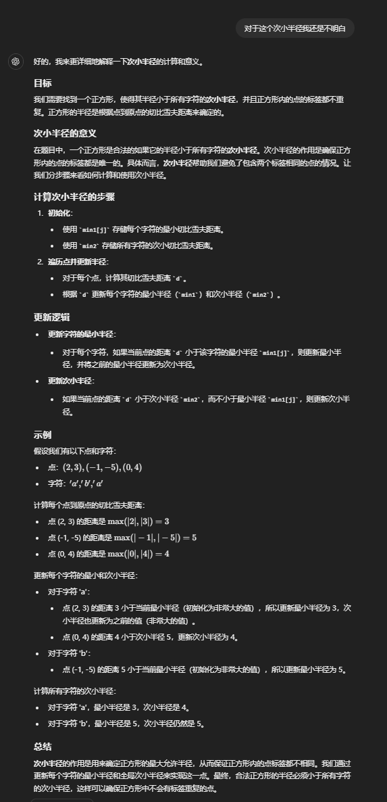
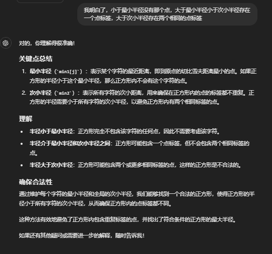

# 2024
## 7月
## 8月
### 8月2日
#### [LCP 40. 心算挑战](https://leetcode.cn/problems/uOAnQW/?envType=daily-question&envId=2024-08-01)
>「力扣挑战赛」心算项目的挑战比赛中，要求选手从 N 张卡牌中选出 cnt 张卡牌，若这 cnt 张卡牌数字总和为偶数，则选手成绩「有效」且得分为 cnt 张卡牌数字总和。 给定数组 cards 和 cnt，其中 cards[i] 表示第 i 张卡牌上的数字。 请帮参赛选手计算最大的有效得分。若不存在获取有效得分的卡牌方案，则返回 0。
> 
>示例 1：
>输入：cards = [1,2,8,9], cnt = 3 
>输出：18  
>解释：选择数字为 1、8、9 的这三张卡牌，此时可获得最大的有效得分 1+8+9=18。
>
>示例 2：
>输入：cards = [3,3,1], cnt = 1
>输出：0   
>解释：不存在获取有效得分的卡牌方案。     
> 
>提示：    
>1 <= cnt <= cards.length <= 10^5   
>1 <= cards[i] <= 1000

首先第一个想到的是肯定需要从大到小进行排序，然后取出前 cnt 张卡牌，如果和为偶，直接返回，如果为奇，则有两种选择：

- 在剩下中找到最大的奇数替换已选中最小的偶数；
- 在剩下中找到最大的偶数替换已选中最小的奇数；

在这两种方案中选择和最大的即可

    class Solution {
        public int maxmiumScore(int[] cards, int cnt) {
            Arrays.sort(cards);
            int res = 0;
            int tmp = 0;
            int odd = -1;
            int even = -1;
            for(int i = cards.length -1; i >= cards.length-cnt; i--){
                tmp += cards[i];
                if((cards[i] & 1) == 0){
                    even = cards[i];
                }else{
                    odd = cards[i];
                }
            }
    
            if((tmp & 1 )== 0){
                return tmp;
            }
    
            for(int i = cards.length - cnt - 1; i >= 0; i--){
                if((cards[i] & 1) != 0){
                    if(even != -1){
                        res = Math.max(res,tmp + cards[i] - even);
                        break;
                    }
                }
            }
    
            for(int i = cards.length - cnt - 1; i >= 0; i--){
                if((cards[i] & 1 )== 0){
                    if(odd != -1){
                        res = Math.max(res,tmp + cards[i] - odd);
                        break;
                    }
                }
            }
    
            return res;
        }
    }

由于是升序排列，逆序遍历，所以取出最后一张卡牌时，odd 和 even 是所选卡牌中最小的奇数和偶数。     
提醒一下，num & 1 可以快速判断奇偶，num & 1 == 0 为偶，否则为奇

### 8月3日
#### [3143. 正方形中的最多点数](https://leetcode.cn/problems/maximum-points-inside-the-square/?envType=daily-question&envId=2024-08-03)
>给你一个二维数组 points 和一个字符串 s ，其中 points[i] 表示第 i 个点的坐标，s[i] 表示第 i 个点的 标签 。如果一个正方形的中心在 (0, 0) ，所有边都平行于坐标轴，且正方形内 不 存在标签相同的两个点，那么我们称这个正方形是 合法 的。请你返回 合法 正方形中可以包含的 最多 点数。  
>注意：    
>如果一个点位于正方形的边上或者在边以内，则认为该点位于正方形内。正方形的边长可以为零。
> 
>输入：points = [[2,2],[-1,-2],[-4,4],[-3,1],[3,-3]], s = "abdca"  输出：2    
> 解释：边长为 4 的正方形包含两个点 points[0] 和 points[1] 。
> 
> 输入：points = [[1,1],[-2,-2],[-2,2]], s = "abb"     
> 输出：1  
> 解释： 边长为 2 的正方形包含 1 个点 points[0] 。

这道题没有思路，看题解的时候对于合法正方形半径必须都小于每个字符的次小半径很难理解，通过后 charGPT 理解了，贴一下

 
复杂度分析：   
时间复杂度：O(n)，其中 n 是数组的长度。     
空间复杂度：O(∣Σ∣)，其中 Σ 是小写字符集的大小， Σ=26。

    class Solution {
        public int maxPointsInsideSquare(int[][] points, String s) {
            int[] min1 = new int[26];
            int n = s.length();
            int min2 = 1000000001;
            Arrays.fill(min1,1000000001);
            for(int i = 0; i < n; i++){
                int[] point = points[i];
                int j = s.charAt(i) - 'a';
                int d = Math.max(Math.abs(point[0]),Math.abs(point[1]));
                if(d < min1[j]){
                    min2 = Math.min(min2,min1[j]);
                    min1[j] = d;
                }else if(d < min2){
                    min2 = d;
                }
            }
    
            int res = 0;
            for(int i : min1){
                if(i < min2){
                    res++;
                }
            }
    
            return res;
        }
    }