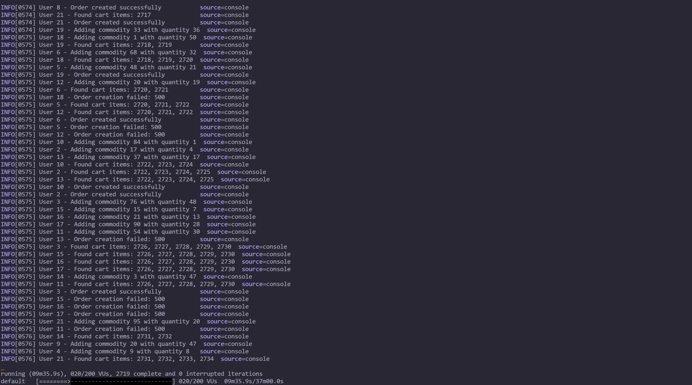

# Docsify 的 LiveReload 脚本报错解决方案
>对于 Docsify 自带 LiveReload 组件加载超时或者想关闭 Docsify 的 LiveReload（实时自动刷新），
>可以通过修改 Node 中 node_modules 文件夹下的 index.js [点击直接到解决方法](#solution)
## LiveReload 加载超时
我发现打开我的网站时，有个 js 脚本加载超时，`https://zy-finn.top:35729/livereload.js?snipver=1` 完整 url 也很奇怪，端口是35729，
docker 中的 Docsify 对应映射的端口是 3000。

## 什么是 LiveReload
查了之后知道 LiveReload 是 Docsify 内置的小客户端
>Docsify 的 livereload 是一个用于实时自动刷新浏览器的功能。它使得在开发过程中，当你修改 Docsify 网站的内容时，浏览器会自动重新加载，显示最新的更改，而无需手动刷新页面。这对于提高开发效率非常有帮助，特别是当你频繁修改内容时。
工作原理
livereload 的工作原理是通过在开发服务器中嵌入一个小型的 JavaScript 客户端，该客户端会定期检查文件的变化。当检测到文件有变动时，客户端会通知浏览器自动刷新页面。
## 端口导致？
为什么会超时，我以为是服务器防火墙没开放 35729 这个端口导致的，但在配置后发现还是超时。

根据 chartGPT 提示，添加 Nginx 配置

但还是超时，那应该是不是由于 LiveReload 在 Docker 端口号是 35729 ，服务器映射的端口不是这个，那启动 Docsify 时指定 LiveReload 端口应该能解决，在 DockerFile
中 CMD 添加 '"--livereload-port", "35729"' 参数，最后还是超时。
## 禁用 LiveReload
好吧，仔细想想我其实用不到这个服务，因为我是通过 Github Action 自动构建推送镜像然后 watchtower 自动更新镜像
部署方式更新的，虽然有几分钟延迟，但本身搭建方式就不支持实时预览。
干脆禁用 LiveReload 吧，发现 Github 上有同样的问题

## 修改 index.js 
但是官方的意思是 Docsify 没有参数提供禁用这个服务，
给出了另外一种方法，修改 Node 中 node_modules 文件夹下的 index.js

## 构建镜像时替换 index.js
但是每次重新构建镜像，这个改动就没有了，我的另一个想法是把修改后的 node 镜像上传，修改 Dockerfile 把修改上传后的 node 镜像作为基础镜像，但是很麻烦，
幸好有人类的好朋友 chartGPT 的帮助，提示可以每次构建镜像时把修改后的 index.js 复制到镜像的相应位置。
我把修改后的 index.js 放在 docs 目录下，在 Dockerfile 中添加 'COPY docs/index.js /usr/local/lib/node_modules/docsify-cli/node_modules/connect-livereload/index.js' 
命令来替换。然后再次打开网站，没有 LiveReload 啦！
