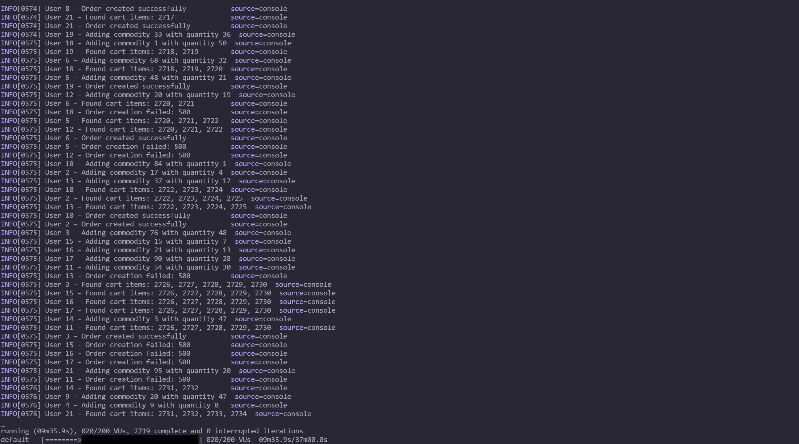
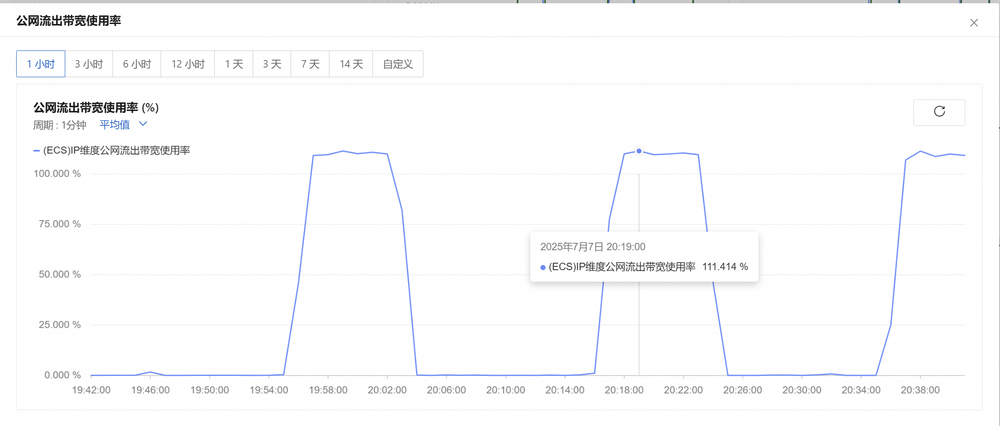
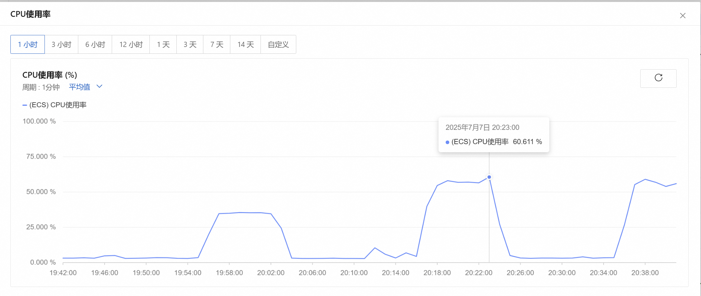
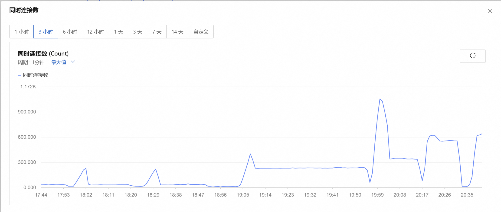
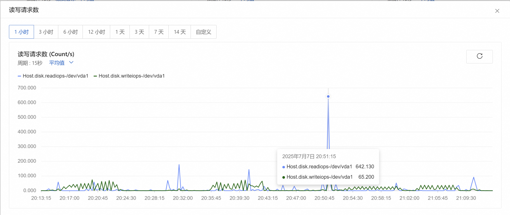

## 环境
服务器配置：阿里云ESC--CentOS 8.0、2 核（vCPU）2 GiB、带宽 3 M
技术栈：go、gin、lua、redis、docker、JavaScript、python、k6   

主要基于 lua + redis 实现库存的原子扣减，docker 打包部署，k6 进行压测检验并排查问题进一步优化，服务器配置较低，尽量追求最大并发量     
由于功能实现比较仓促，本文主要重点在于分析和优化部分
## 初始化库存
```go
// Redis 库存数据结构
const (
    STOCK_KEY_PREFIX      = "mall:stock:item:" // 商品库存主数据 key
    STOCK_LOCK_KEY_PREFIX = "mall:stock:lock:" // 库存锁 key
    STOCK_LOG_KEY_PREFIX  = "mall:stock:log:"  // 库存流水 key
    STOCK_INIT_SETKEY     = "mall:stock:init"  // 已初始化商品集合
)
```
系统启动时全量初始化
```go
func main() {
    // ... 其他初始化
    
    // 启动库存初始化
	stockService := appservice.NewCommodityAppSvc(context.Background())
	if err := stockService.InitRedisStock(); err != nil {
		log.Error("Failed to init stock: %v", err)
	}

	// ... 启动服务
}
```
全量初始化实现，商品数量多可以分批初始化，避免大key问题
```go
func (cds *CommodityDomainSvc) InitRedisStock() error {
	commodityModels, _ := cds.commodityDao.GetAllCommodity()
	pipeline := cache.Redis().Pipeline()
	stockItems := make([]*do.StockItem, 0)
	for _, commodity := range commodityModels {
		stockItems = append(stockItems, &do.StockItem{
			InitStock: commodity.StockNum,
			Stock:     commodity.StockNum,
			Modified:  time.Now(),
			Version:   1,
			ItemID:    commodity.ID,
		})
	}
	for _, stockItem := range stockItems {
		stockKey := fmt.Sprintf("%s%d", enum.STOCK_KEY_PREFIX, stockItem.ItemID)
		pipeline.HSet(cds.ctx, stockKey, map[string]interface{}{
			"id":        stockItem.ItemID,
			"stock":     stockItem.Stock,
			"version":   stockItem.Version,
			"modified":  stockItem.Modified.Format(time.RFC3339),
			"initStock": stockItem.InitStock,
		})
		pipeline.SAdd(cds.ctx, enum.STOCK_INIT_SETKEY, stockItem.ItemID)
		pipeline.Expire(cds.ctx, stockKey, 30*24*time.Hour) // 30天过期
	}
	if _, err := pipeline.Exec(cds.ctx); err != nil {
		return errcode.Wrap("初始化商品库存错误", err)
	}
	return nil
}
```
## 库存扣减
lua脚本
```lua
-- KEYS[1]: 库存key
-- KEYS[2]: 库存日志key
-- KEYS[3]: 锁key
-- ARGV[1]: 扣减数量
-- ARGV[2]: 订单ID
-- ARGV[3]: 用户ID
-- ARGV[4]: 超时时间(ms)
-- ARGV[5]: 当前时间戳

--尝试获取锁
local lock = redis.call("SET", KEYS[3], "LOCK", "NX", "PX", tonumber(ARGV[4]))
if not lock then
    return {err = "E_LOCK_FAILED", msg = "Failed to acquire lock"}
end

--获取当前库存
local stockData = redis.call("HGETALL", KEYS[1])
if #stockData == 0 then
    redis.call("DEL", KEYS[3])
    return {err = "E_ITEM_NOT_FOUND", msg = "Item not found"}
end

-- 解析库存数据
local currentStock = nil
local version = nil
for i = 1, #stockData, 2 do
    if stockData[i] == "stock" then
        currentStock = tonumber(stockData[i+1])
    elseif stockData[i] == "version" then
        version = tonumber(stockData[i+1])
    end
end

if currentStock == nil or version == nil then
    redis.call("DEL", KEYS[3])
    return {err = "E_INVALID_STOCK_DATA", msg = "Invalid stock data"}
end

local deductQty = tonumber(ARGV[1])

-- 检查库存是否充足
if currentStock < deductQty then
    redis.call("DEL", KEYS[3])
    return {err = "E_STOCK_INSUFFICIENT", msg = "Insufficient stock"}
end

-- 更新库存
local newStock = currentStock - deductQty
local newVersion = version + 1

redis.call("HMSET", KEYS[1],
    "stock", newStock,
    "version", newVersion,
    "modified", ARGV[5]
)

-- 记录日志
local logEntry = {
    order_id = ARGV[2],
    user_id = ARGV[3],
    item_id = string.match(KEYS[1], "item:(%d+)$"),
    quantity = deductQty,
    old_stock = currentStock,
    new_stock = newStock,
    timestamp = ARGV[5],
    is_rollback = false
}

redis.call("RPUSH", KEYS[2], cjson.encode(logEntry))

-- 释放锁
redis.call("DEL", KEYS[3])

return {status = "SUCCESS", stock = newStock, version = newVersion}
`)
```
接口实现
```go
func (cd *CommodityDao) ReduceStuckInOrderCreateByLua(tx *gorm.DB, orderItems []*do.OrderItem, userId int64) error {
	redisStockService := cache.RedisStockService()
	deductStockLuaHandler, _ := resources.LoadResourceFile("deduct_stock.lua")
	scriptContent, err := io.ReadAll(deductStockLuaHandler)
	if err != nil {
		panic(err)
	}
	// 使用 redis.NewScript 来封装 Lua 脚本
	script := redis.NewScript(string(scriptContent))
	sha, _ := script.Load(cd.ctx, redisStockService).Result()
	for _, orderItem := range orderItems {
		stockKey := fmt.Sprintf("%s%d", enum.STOCK_KEY_PREFIX, orderItem.CommodityId)
		logKey := fmt.Sprintf("%s%d", enum.STOCK_LOG_KEY_PREFIX, orderItem.CommodityId)
		lockKey := fmt.Sprintf("%s%d", enum.STOCK_LOCK_KEY_PREFIX, orderItem.CommodityId)
		// 准备参数
		args := []interface{}{
			orderItem.CommodityNum,
			orderItem.OrderId,
			userId,
			500, // 500ms 锁超时
			time.Now().Format(time.RFC3339),
		}
		//执行脚本
		result, err := redisStockService.EvalSha(cd.ctx, sha, []string{stockKey, logKey, lockKey}, args...).Result()
		if err != nil {
			return errcode.Wrap("deduction failed: %w", err)
		}
		// 解析结果
		if resultMap, ok := result.([]interface{}); ok {
			if len(resultMap) > 0 && resultMap[0] == "err" {
				return errors.New(resultMap[2].(string))
			}

			// 成功返回
			status := resultMap[0].(string)
			if status == "SUCCESS" {
				return nil
			}
		}
	}
	return errors.New("unknown deduction error")
}
```
## 压测环境准备
docker redis 容器启动
```bash
# 1. 创建专用测试网络
docker network create perf-net
# 2. 启动Redis容器（禁用持久化）
docker run -d \
  --name redis-stock \
  --network pref-net \
  --memory="1g" \
  --cpus="1" \
  -p 6380:6380 \
  6642 \
  --save "" \
  --appendonly no \
  --port 6380
```
服务镜像构建
```dockerfile
# 构建阶段
FROM swr.cn-north-4.myhuaweicloud.com/ddn-k8s/docker.io/library/golang:1.23.8-alpine AS builder

# 设置构建环境
ENV GOPROXY=https://goproxy.cn,direct \
    CGO_ENABLED=0 \
    GOOS=linux

WORKDIR /app
COPY . .

# 使用缓存挂载提高构建速度
RUN --mount=type=cache,target=/go/pkg/mod \
    --mount=type=cache,target=/root/.cache/go-build \
    go mod tidy && go build -o go-mall .

# 运行阶段 - 使用 Alpine 基础镜像
FROM swr.cn-north-4.myhuaweicloud.com/ddn-k8s/docker.io/library/alpine:3.18

# 安装必要的运行时依赖
RUN apk add --no-cache \
    ca-certificates \
    tzdata && \
    ln -sf /usr/share/zoneinfo/Asia/Shanghai /etc/localtime

# 从构建阶段复制二进制文件
COPY --from=builder /app/go-mall /usr/local/bin/

# 设置容器启动命令
CMD ["go-mall"]
```
```bash
#构建镜像
docker build -t go-mall:lastest .
# 3. 启动Go微服务容器（绑定测试网络）
docker run -d --name stock_service \
  --network pref-net \
  -e REDIS_STOCK_ADDR=redis-stock:6380 \
  -e env=dev \
  -p 8080:8080 \
  go-mall:lastest
```
### 库存初始化
库存初始化成功


### k6安装
```bash
sudo yum install https://dl.k6.io/rpm/repo.rpm
sudo yum install k6
k6 version
```
### 脚本
账号注册脚本 python，注册了1000个账号，拿到token.json，后面调用接口直接加载文件从token池中拿
```python
import requests
import json
import time

# API 地址
REGISTER_URL = "http://localhost:8080/user/register"
LOGIN_URL = "http://localhost:8080/user/login"

# 公共请求头
REGISTER_HEADERS = {
  "User-Agent": "Apifox/1.0.0 (https://apifox.com)",
  "Content-Type": "application/json",
  "Accept": "*/*",
  "Host": "localhost:8080",
  "Connection": "keep-alive"
}

LOGIN_HEADERS = {
  "platform": "H5",
  "User-Agent": "Apifox/1.0.0 (https://apifox.com)",
  "Content-Type": "application/json",
  "Accept": "*/*",
  "Host": "localhost:8080",
  "Connection": "keep-alive"
}

PASSWORD = "Test1234."

tokens = {}

for i in range(1, 1001):
  email = f"user{i:04d}@163.com"

  # 1. 注册
  register_payload = {
    "login_name": email,
    "password": PASSWORD,
    "password_confirm": PASSWORD,
    "nickname": f"Ian{i}",
    "slogan": "live like tomorrow doesn't exist"
  }

  try:
    reg_resp = requests.post(REGISTER_URL, headers=REGISTER_HEADERS,
                             json=register_payload, timeout=10)
    reg_resp.raise_for_status()
  except Exception as e:
    print(f"[{email}] 注册失败: {e}")
    continue

  # 2. 登录
  login_payload = {
    "login_name": email,
    "password": PASSWORD
  }

  try:
    login_resp = requests.post(LOGIN_URL, headers=LOGIN_HEADERS,
                               json=login_payload, timeout=10)
    login_resp.raise_for_status()
    login_data = login_resp.json()
    # 根据你的接口返回结构修改
    token = login_data.get("data", {}).get("access_token")
    if not token:
      print(f"[{email}] 登录成功但未获取到access_token: {login_data}")
      continue
    tokens[email] = token
    print(f"[{email}] 注册并登录成功，token已记录")
  except Exception as e:
    print(f"[{email}] 登录失败: {e}")

  # 避免请求过快
  time.sleep(0.2)

# 保存到JSON
with open("tokens.json", "w", encoding="utf-8") as f:
  json.dump(tokens, f, indent=2, ensure_ascii=False)

print(f"\n已完成注册和登录，共收集 {len(tokens)} 个access_token")
```
javascript脚本通过 claude 辅助编写
```javascript
import http from 'k6/http';
import { check, sleep } from 'k6';
import { SharedArray } from 'k6/data';

// 从JSON读取token
const tokensData = new SharedArray('tokens', function() {
  const json = JSON.parse(open('./tokens.json'));
  return Object.values(json); // 只取token
});

// 压测配置
export let options = {
  stages: [
    { duration: '30s', target: 10 },
    { duration: '1m', target: 50 },
    { duration: '1m', target: 100 },
    { duration: '2m', target: 200 },
    { duration: '1m', target: 0 },
  ],
  thresholds: {
    http_req_duration: ['p(95)<500'],
  }
};

export default function () {
  const token = tokensData[Math.floor(Math.random() * tokensData.length)];
  const commodityId = Math.floor(Math.random() * 102) + 1;
  const commodityNum = Math.floor(Math.random() * 50) + 1;  // 随机1-50

  // 添加购物车
  const addCartRes = http.post(
      'http://8.152.1.109:8080/cart/addCartItem',
      JSON.stringify({
        commodity_id: commodityId,
        commodity_num: commodityNum
      }),
      {
        headers: {
          'go-mall-token': token,
          'Content-Type': 'application/json',
          'User-Agent': 'k6-load-test'
        }
      }
  );

  check(addCartRes, {
    'addCartItem status 200': (r) => r.status === 200,
    'addCartItem has data': (r) => r.json('data') !== undefined,
  });

  const cartItemId = addCartRes.json('data.cart_item_id');
  if (!cartItemId) {
    console.error('No cart_item_id returned');
    return;
  }

  // 创建订单
  const createOrderRes = http.post(
      'http://8.152.1.109:8080/order/create',
      JSON.stringify({
        cart_item_id_list: [cartItemId],
        user_address_id: 1
      }),
      {
        headers: {
          'go-mall-token': token,
          'Content-Type': 'application/json',
          'User-Agent': 'k6-load-test'
        }
      }
  );

  check(createOrderRes, {
    'createOrder status 200': (r) => r.status === 200,
    'createOrder code=0': (r) => r.json('code') === 0,
  });

  sleep(0.1);
}

```
```bash
# 运行测试
k6 run mall_inventory_test.js

# 生成HTML报告
k6 run --out web-dashboard mall_inventory_test.js

# 保存结果到文件
k6 run --out json=results.json mall_inventory_test.js
```
结果
```
  █ THRESHOLDS 

    http_req_duration
    ✗ 'p(95)<500' p(95)=6.72s


  █ TOTAL RESULTS 

    checks_total.......................: 25966  78.669033/s
    checks_succeeded...................: 71.84% 18656 out of 25966
    checks_failed......................: 28.15% 7310 out of 25966

    ✗ addCartItem status 200
      ↳  99% — ✓ 6489 / ✗ 6
    ✗ addCartItem has data
      ↳  99% — ✓ 6489 / ✗ 6
    ✗ createOrder status 200
      ↳  43% — ✓ 2839 / ✗ 3649
    ✗ createOrder code=0
      ↳  43% — ✓ 2839 / ✗ 3649

    HTTP
    http_req_duration.......................................................: avg=2.33s min=7.87ms   med=1.56s max=1m0s   p(90)=5.22s p(95)=6.72s 
      { expected_response:true }............................................: avg=1.76s min=7.87ms   med=1.05s max=54.17s p(90)=4.28s p(95)=5.67s 
    http_req_failed.........................................................: 28.15% 3655 out of 12983
    http_reqs...............................................................: 12983  39.334516/s

    EXECUTION
    iteration_duration......................................................: avg=4.77s min=122.29ms med=3.61s max=1m6s   p(90)=9.99s p(95)=12.14s
    iterations..............................................................: 6494   19.674832/s
    vus.....................................................................: 1      min=1             max=200
    vus_max.................................................................: 200    min=200           max=200

    NETWORK
    data_received...........................................................: 3.8 MB 11 kB/s
    data_sent...............................................................: 3.0 MB 9.2 kB/s


running (5m30.1s), 000/200 VUs, 6494 complete and 2 interrupted iterations
default ✓ [======================================] 000/200 VUs  5m30s
ERRO[0330] thresholds on metrics 'http_req_duration' have been crossed 
```
## 分析
结果惨不忍睹，最大才 200 VUs 的并发量，95% 请求 6.7s，createOrder 这个接口甚至一大半是失败的   
根据报错内容请求超时和JSON body null，后者是因为超时没有返回，所以 r.json() 抛出错误，请求超时可能的原因是服务器并发压力太大或 Redis / DB 锁竞争或者可能库存逻辑或事务阻塞
## 优化
1. 每个订单都重新LOAD一次脚本到Redis 这就导致：Redis端每次都在编译脚本然后执行，并且在并发场景下，你同一个脚本在多协程中高并发同时加载所以：实际上你把Redis自己堵死了，脚本LOAD比执行本身还要慢
2. lua脚本本身就是原子，加锁其实没必要，因为每次库存扣减都只用这个Lua脚本
3. 查询商品信息属于热点数据，项目启动的时候加载到缓存中 
4. 购物车、库存、订单都在Redis,创建订单Lua脚本——>校验库存——>扣库存——>删除购物车——>写订单状态——>返回下单成功——>异步订单写入db，减少数据库事务带来的性能瓶颈（锁、行锁争用、事务日志）

修改后的lua脚本，简化版
```
-- KEYS:
-- [1] 购物车 Key
-- [2] 库存 Key
-- [3] 订单 Key
-- [4] 订单商品 Key

-- ARGV:
-- [1] 用户ID
-- [2] 订单号
-- [3...] 每个商品: commodityId, quantity, price

local userId = ARGV[1]
local orderNo = ARGV[2]
local i = 3

while i <= #ARGV do
    local commodityId = ARGV[i]
    local quantity = tonumber(ARGV[i+1])

    -- 检查库存
    local stock = tonumber(redis.call("HGET", KEYS[2] .. commodityId, "stock"))
    if not stock or stock < quantity then
        return {err="库存不足"}
    end

    -- 扣减库存
    redis.call("HINCRBY", KEYS[2] .. commodityId, "stock", -quantity)

    -- 删除购物车
    redis.call("HDEL", KEYS[1], commodityId)

    -- 写订单商品
    redis.call("HSET", KEYS[4], commodityId, quantity)

    i = i + 2
end

-- 写订单主表
redis.call("HMSET", KEYS[3],
    "userId", userId,
    "orderNo", orderNo,
    "status", "created"
)

return "OK"
```
重新打包部署镜像，结果
```
  █ THRESHOLDS

    http_req_duration
    ✗ 'p(95)<500' p(95)=555.59ms


  █ TOTAL RESULTS

    checks_total.......................: 312896  947.719698/s
    checks_succeeded...................: 100.00% 312896 out of 312896
    checks_failed......................: 0.00%   0 out of 312896

    ✓ addCartItem status 200
    ✓ addCartItem has data
    ✓ createOrder status 200
    ✓ createOrder code=0

    HTTP
    http_req_duration.......................................................: avg=144.32ms min=24.06ms  med=36.44ms  max=34.51s p(90)=316.93ms p(95)=555.59ms
      { expected_response:true }............................................: avg=144.32ms min=24.06ms  med=36.44ms  max=34.51s p(90)=316.93ms p(95)=555.59ms
    http_req_failed.........................................................: 0.00%  0 out of 156448
    http_reqs...............................................................: 156448 473.859849/s

    EXECUTION
    iteration_duration......................................................: avg=389.22ms min=150.35ms med=176.91ms max=34.66s p(90)=815.08ms p(95)=1.11s
    iterations..............................................................: 78224  236.929924/s
    vus.....................................................................: 1      min=1           max=200
    vus_max.................................................................: 200    min=200         max=200

    NETWORK
    data_received...........................................................: 34 MB  102 kB/s
    data_sent...............................................................: 35 MB  105 kB/s


                                                                                                                                                                                                        
running (5m30.2s), 000/200 VUs, 78224 complete and 0 interrupted iterations                                                                                                                             
default ✓ [======================================] 000/200 VUs  5m30s                                                                                                                                   
ERRO[0330] thresholds on metrics 'http_req_duration' have been crossed
```
### 分析
p(95)=555.59ms 相较之前的 p(95)=6.72s 有很大提升      

目前主要性能瓶颈在于带宽，公网流出带宽使用率超过100%，CPU使用率最高50% 表明服务器计算资源尚未达到瓶颈，网络带宽已成为系统瓶颈
### 贴一下服务器资源监控





解决办法是1. 最直接的是提高带宽 2. 响应数据压缩 3. 精简响应体        

提高并发量试了下，勉勉强强，失败的接口都是因为超时
```
  █ THRESHOLDS

    http_req_duration
    ✗ 'p(95)<500' p(95)=1.15s


  █ TOTAL RESULTS

    checks_total.......................: 480366 1067.184428/s
    checks_succeeded...................: 99.91% 479948 out of 480366
    checks_failed......................: 0.08%  418 out of 480366

    ✗ addCartItem status 200
      ↳  99% — ✓ 120053 / ✗ 78
    ✗ addCartItem has data
      ↳  99% — ✓ 120053 / ✗ 78
    ✗ createOrder status 200
      ↳  99% — ✓ 119921 / ✗ 131
    ✗ createOrder code=0
      ↳  99% — ✓ 119921 / ✗ 131

    HTTP
    http_req_duration.......................................................: avg=463.42ms min=24.04ms  med=38.9ms   max=1m0s   p(90)=727.44ms p(95)=1.15s
      { expected_response:true }............................................: avg=414.15ms min=24.04ms  med=38.89ms  max=59.98s p(90)=723.5ms  p(95)=1.14s
    http_req_failed.........................................................: 0.08%  209 out of 240183
    http_reqs...............................................................: 240183 533.592214/s

    EXECUTION
    iteration_duration......................................................: avg=1.02s    min=151.02ms med=417.06ms max=1m35s  p(90)=1.51s    p(95)=2.52s
    iterations..............................................................: 120124 266.868309/s
    vus.....................................................................: 1      min=1             max=499
    vus_max.................................................................: 500    min=500           max=500

    NETWORK
    data_received...........................................................: 52 MB  115 kB/s
    data_sent...............................................................: 53 MB  118 kB/s


                                                                                                                                                                                                        
running (7m30.1s), 000/500 VUs, 120124 complete and 14 interrupted iterations                                                                                                                           
default ✓ [======================================] 000/500 VUs  7m30s                                                                                                                                   
ERRO[0450] thresholds on metrics 'http_req_duration' have been crossed
```

